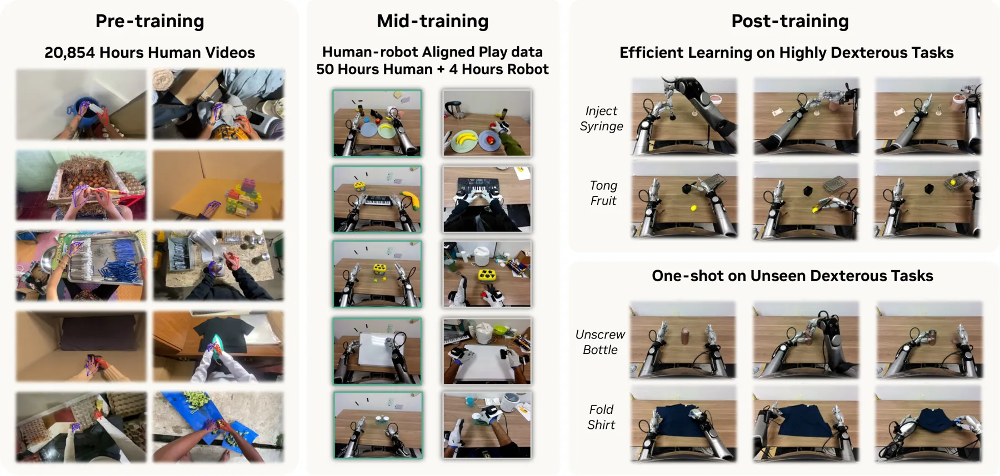

# EgoScale：大规模第一视角人类数据驱动的灵巧操作迁移

EgoScale 关注机器人灵巧操作数据难以大规模采集的问题。论文利用规模更大的第一视角人类操作视频学习通用 manipulation prior，再通过少量 aligned human-robot data 完成 Human-to-Robot transfer，最后使用具体任务的机器人遥操作数据完成任务适配。

<div class="paper-overview" markdown>

{ loading=lazy }

<span class="paper-overview__caption">图：EgoScale 的 human pre-training、aligned human–robot mid-training 与 downstream post-training 流程。图片来自论文官方版本。</span>

</div>

<!-- more -->

## 论文信息

- **论文：** [EgoScale: Scaling Dexterous Manipulation with Diverse Egocentric Human Data](https://arxiv.org/abs/2602.16710)
- **作者：** Ruijie Zheng, Dantong Niu, Yuqi Xie, Jing Wang, Mengda Xu, Yunfan Jiang, Fernando Castañeda, Fengyuan Hu, You Liang Tan, Letian Fu, Trevor Darrell, Furong Huang, Yuke Zhu, Danfei Xu, Linxi Fan
- **机构：** NVIDIA, University of California, Berkeley, University of Maryland
- **发布：** arXiv, 2026
- **项目主页：** [NVIDIA GEAR](https://research.nvidia.com/labs/gear/egoscale/)
- **代码：** 官方项目页目前标注为 Coming Soon

## 1. 整体训练框架

EgoScale 使用同一个 flow-based VLA 依次完成三个训练阶段：

```text
Stage I：Human Pre-training
20,854 h 第一视角 Human Data
        ↓
学习大规模 human manipulation prior
        ↓
Stage I checkpoint

Stage II：Aligned Human-Robot Mid-training
约 50 h Human + 4 h Robot
        ↓
完成 Human-to-Robot grounding
        ↓
Stage II checkpoint

Stage III：Task-specific Robot Post-training
具体任务的 Robot Teleoperation Data
        ↓
完成 task-specific policy adaptation
        ↓
Final Task Policy
```

Stage I 负责从大规模人类数据中学习操作先验，Stage II 负责缩小 human 与 robot 在感知和控制空间中的差异，Stage III 负责利用少量具体任务的机器人示范得到最终任务策略。

---

## 2. Stage I：Large-Scale Egocentric Human Pre-training

### 2.1 Stage I 流程

```text
20,854 h Human Egocentric Video
        ↓
────────────────────────────────
动作监督构造
────────────────────────────────

RGB Video
   ├──────────────→ SLAM
   │                  ↓
   │             Camera Pose
   │
   └──────────────→ Hand Pose Estimation
                      ↓
                Human Hand Keypoints

Camera Pose + Wrist Keypoint
        ↓
Wrist Pose in World
        ↓
Relative Wrist Motion
        │
        │
Human Hand Keypoints
        ↓
Hand Retargeting
        ↓
Sharpa 22-DoF Hand Action
        │
        └──────────────┐
                       ↓
             Human Action Supervision
                       │
                       ↓
────────────────────────────────
VLA 训练
────────────────────────────────

Current RGB I_t + Language l_t
        ↓
VLM
        ↓
Vision-Language Condition φ_t
        │
        │
Human Proprioception 不存在
        ↓
Learnable Placeholder
        │
        │
GT Future Action Chunk
        ↓
Flow Matching 构造 Noisy Action
        ↓
Action Encoder
        ↓
DiT Action Expert
        ↓
Action Decoder
        ↓
Future Action Prediction
        ↓
Flow-Matching Objective
        ↓
Backpropagation
        ↓
Stage I Checkpoint
```

### 2.2 数据与动作监督构造

Stage I 使用 20,854 小时第一视角人类视频，其中包括 829 小时 EgoDex。数据覆盖 9,869 个场景、6,015 个任务和 43,237 个物体。

普通 RGB 视频没有机器人动作标签，因此需要先从视频中恢复 human motion。SLAM 用于估计相机在世界坐标系中的位姿：

$$
\mathbf{T}_{w\leftarrow c}^{t}\in \mathrm{SE}(3)
$$

Hand Pose Estimation 用于估计人手关键点，其中 wrist pose 记为：

$$
\mathbf{H}_{c,1}^{t}\in \mathrm{SE}(3)
$$

将 wrist 从 camera frame 转换到 world frame：

$$
\mathbf{W}_{w}^{t}
=
\mathbf{T}_{w\leftarrow c}^{t}\mathbf{H}_{c,1}^{t}
$$

随后构造 relative wrist motion：

$$
\Delta \mathbf{W}^{t}
=
\left(\mathbf{W}_{w}^{0}\right)^{-1}\mathbf{W}_{w}^{t}
$$

这部分作为 arm-level action supervision，并与后续 robot 的 relative EEF control 形成对应。

手部动作通过 optimization-based hand retargeting 转换到 Sharpa 22-DoF joint space：

```text
Human Hand Keypoints
        ↓
Robot URDF + Forward Kinematics
        ↓
逐帧非线性优化
        ↓
Sharpa 22-DoF Joint Angles
```

Appendix D 进一步说明，retargeting 使用 CasADi 建模、IPOPT 求解，并使用上一帧结果 warm start；输出还经过一阶指数滤波以减小时间抖动。

### 2.3 Training Sample

从一条 human trajectory 中选择时刻 $t$。当前输入包含图像 $I_t$、语言指令 $l_t$ 和 human placeholder，监督目标是一段 future action chunk：

$$
\mathbf{A}_{t}^{*}
=
\left[
\mathbf{a}_{t},
\mathbf{a}_{t+1},
\ldots,
\mathbf{a}_{t+H-1}
\right]
$$

每个 action 由 relative wrist motion 和 retargeted hand joint action 组成。论文没有给出 action chunk length $H$ 的具体数值。

Human demonstration 不包含 robot proprioception，因此使用 learnable placeholder 替代 $q_t$，从而保持与 robot sample 相同的模型接口。

### 2.4 Loss 与参数更新

Stage I 使用 **Flow Matching** 训练 future action chunk。论文明确给出 flow-matching objective，但没有展开 noise distribution、interpolation path、flow time sampling 和具体 loss 公式。

训练设置：

```text
100K steps
256 × GB200 GPUs
Global Batch Size = 8192
Learning Rate = 5 × 10^-5
```

Stage I 对整个 VLA 进行全参数训练。训练结束后得到 Stage I checkpoint，主要包含从大规模 human data 中学习到的 manipulation prior。

---

## 3. Stage II：Aligned Human-Robot Mid-training

### 3.1 Stage II 流程

```text
Stage I Checkpoint
        ↓
────────────────────────────────
Aligned Human-Robot Play Data
────────────────────────────────

Human Data                     Robot Data
约 50 h                        约 4 h
~30 traj / task                ~5 traj / task
        │                            │
        │                            │
Head + 2 Wrist RGB             Head + 2 Wrist RGB
Vive Wrist Pose                Robot Proprioception q_t
Manus Hand Pose                Robot Teleoperation Action
        │                            │
        ↓                            ↓
Relative Wrist Motion          Relative EEF Motion
+                              +
Human Hand Action              Real Sharpa Hand Action
        │                            │
        └──────────────┬─────────────┘
                       ↓
                    Co-training
                       ↓

Current RGB + Language
        ↓
Vision Encoder
        ↓
Vision-Language Backbone
        ↓
Vision-Language Condition φ_t
        │
        │
Robot Sample：Real q_t
Human Sample：Placeholder
        │
        │
GT Future Action Chunk
        ↓
Flow Matching 构造 Noisy Action
        ↓
Action Encoder
        ↓
DiT Action Expert
        ↓
Action Decoder
        ↓
Future Action Prediction
        ↓
Flow-Matching Objective
        ↓
Backpropagation
        ↓
Stage II Checkpoint
```

### 3.2 Aligned Human-Robot Data

Stage II 使用 344 个 tabletop manipulation tasks，每个任务约包含 30 条 human trajectories 和 5 条 robot trajectories，总计约 50 小时 human data 和 4 小时 robot data。

这里的 alignment 不是 human 与 robot trajectory 的逐帧配对，而是从任务、场景、相机视角和动作表示多个层面缩小 Human-Robot gap。

Human demonstration 使用 1 个 head camera 和 2 个 wrist cameras，并尽量与 robot sensing setup 匹配。Vive tracker 提供 wrist position 和 orientation，Manus glove 提供手部 joint transforms。

Robot data 来自真实机器人遥操作。主平台为 Galaxea R1 Pro，使用一个 head camera、两个 wrist cameras、双 7-DoF arms 和双 22-DoF Sharpa hands。

### 3.3 Human 与 Robot 的共同动作表示

Robot arm 不直接预测 7 个 arm joint targets，而是在 relative end-effector space 中控制：

```text
incremental position change
+
incremental orientation change
```

因此 arm-level representation 建立了以下对应：

```text
Human：
Relative Wrist Motion

Robot：
Relative EEF Motion
```

Robot hand 使用 22-DoF joint-space control，动作直接表示 Sharpa target joint angles。

Stage II 中两类 sample 的监督结构分别为：

```text
Human Sample
Current Human RGB + Language + Placeholder
        ↓
Future Relative Wrist Motion
+
Human Hand Action

Robot Sample
Current Robot RGB + Language + Real q_t
        ↓
Future Relative EEF Motion
+
Real Sharpa Hand Joint Action
```

Human 和 robot sample 共同训练同一个 Stage I checkpoint。论文没有给出 human / robot sampling ratio、batch 内比例或两类数据的 loss weighting。

### 3.4 Human-Robot Alignment

Stage II 没有额外设计 feature-level alignment loss，也没有明确使用 contrastive loss 或 human-robot feature MSE。Human-Robot alignment 主要来自：

```text
Aligned Tasks / Scenes / Camera Viewpoints
+
Shared Action Representation
+
Shared VLA
+
Human-Robot Co-training
```

因此这一阶段的关键是通过对齐数据与共享模型，将 Stage I 的 human representation ground 到 robot sensing 与 control space。

### 3.5 Loss 与参数更新

Stage II 仍使用 **Flow-Matching Objective** 训练 future action chunk。

训练设置：

```text
50K steps
Batch Size = 2048
Learning Rate = 3 × 10^-5
```

参数更新策略：

```text
Vision-Language Backbone
→ Frozen

Vision Encoder
→ Train

DiT Action Expert
→ Train
```

Stage II 数据规模远小于 Stage I，因此冻结 Vision-Language Backbone 以保留 Stage I 学到的视觉语言表示；Vision Encoder 和 DiT Action Expert 继续适应 robot visual domain 与真实 robot control。

对于 Unitree G1 等额外 embodiment，论文还使用 embodiment-conditioned MLP adapters 处理不同 robot proprioception 和 hand action space。该部分不是 Stage II 主流程的重点，此处不展开。

---

## 4. Stage III：Task-specific Robot Post-training

### 4.1 Stage III 流程

```text
Stage II Checkpoint
        ↓
────────────────────────────────
Task-specific Robot Teleoperation Data
────────────────────────────────

Robot Demonstration
│
├── Head RGB
├── Left Wrist RGB
├── Right Wrist RGB
├── Language Instruction
├── Real Robot Proprioception q_t
└── Robot Action
      ├── Relative EEF Motion
      └── Sharpa Hand Joint Action
        │
        ↓
从 trajectory 采样时刻 t
        ↓

Current Robot RGB I_t
+
Language l_t
+
Real q_t
        │
        │
GT Future Robot Action Chunk
        ↓
Flow Matching 构造 Noisy Action
        ↓
Action Encoder
        ↓
DiT Action Expert
        ↓
Action Decoder
        ↓
Future Robot Action Prediction
        ↓
Flow-Matching Objective
        ↓
Backpropagation
        ↓
Task-specific Fine-tuning
        ↓
Final Task Policy
```

### 4.2 Robot Teleoperation Data

Stage III 使用具体下游任务的真实 robot teleoperation demonstrations。

主实验包含五个任务：

- Shirt Rolling：20 条 robot demonstrations
- Card Sorting：100 条
- Tongs for Fruit Transfer：100 条
- Bottle Cap Unscrewing：100 条
- Syringe Liquid Transfer：100 条

一条完整 trajectory 包含三路 RGB、语言任务、真实 robot proprioception 和逐时刻 robot action。

Stage III 的 action supervision 直接来自真实机器人控制，不再需要 SLAM、Human Hand Pose Estimation 或 Human-to-Robot Retargeting：

```text
Arm：
Relative EEF Motion

Hand：
22-DoF Sharpa Target Joint Angles
```

从 trajectory 选择时刻 $t$ 后，模型条件输入为：

$$
(I_t,l_t,q_t)
$$

监督目标为 future robot action chunk $\mathbf{A}_t^*$。

### 4.3 Loss 与参数更新

Stage III 沿用相同的 Flow Matching 动作生成训练方式，没有引入额外 task reward 或 reinforcement-learning objective。

训练设置：

```text
10K steps
Batch Size = 512
Learning Rate = 3 × 10^-5
```

论文明确给出的冻结规则：

```text
已经经过 Stage II：
Vision Encoder → Frozen

没有经过 Stage II：
Vision Encoder → Unfrozen
```

对于 Vision-Language Backbone、DiT Action Expert、Action Encoder、Action Decoder 和 embodiment adapters，论文没有给出 Stage III 的完整 freeze / unfreeze table，因此不能进一步确定各模块的精确更新状态。

Stage III 最终将 Stage II 得到的 robot-grounded representation 适配到具体下游任务。

---

## 5. 核心模型与算法

### 5.1 VLM

VLM 接收当前视觉观测和语言指令：

$$
(I_t,l_t)
$$

并得到 Vision-Language Embedding：

$$
\phi_t
$$

$\phi_t$ 是动作生成的条件表示，用于编码当前场景、目标对象和任务语义。

VLM 不直接生成 noisy action，也不直接输出最终机器人控制量：

```text
Image + Language
        ↓
VLM
        ↓
Vision-Language Condition φ_t
        │
        ▼
Action Generation
```

### 5.2 DiT Action Expert

DiT Action Expert 是 VLA 中负责连续动作生成的核心模块。它处理的是经过 Action Encoder 得到的 noisy action representation，并受到 $\phi_t$ 和 robot state $q_t$ 的条件控制：

```text
Noisy Action
        ↓
Action Encoder
        ↓
Action Representation
        │
        │    Vision-Language Condition φ_t
        │    Robot State q_t / Human Placeholder
        ▼
DiT Action Expert
        ↓
Action Decoder
        ↓
EEF Pose + Joint Angle
```

论文没有展开 EgoScale 中 DiT block 的内部 Q/K/V、Self-Attention、Cross-Attention 或 AdaLN 结构，因此这些实现细节不能从本文直接确定。

### 5.3 Action Encoder 与 Action Decoder

Action Encoder 将连续物理动作转换为 DiT 使用的内部表示：

```text
Noisy EEF Pose + Noisy Joint Angle
        ↓
Action Encoder
        ↓
Internal Action Representation
```

Action Decoder 完成反向映射：

```text
DiT Hidden Representation
        ↓
Action Decoder
        ↓
EEF Pose + Joint Angle
```

因此 Action Decoder 是动作生成模型的输出接口，而不是另一个 Transformer decoder。

### 5.4 Flow Matching

EgoScale 使用 Flow Matching 生成 future action chunk。

训练时存在 GT future action，因此可以从 GT action 构造 noisy/intermediate action，并训练模型学习从 noisy action 向真实 action 分布演化。

推理时不存在 GT action，动作生成从随机/noisy future action 初始化，再由 DiT Action Expert 在视觉语言条件与 robot state 的约束下迭代生成最终 action chunk。

论文没有给出具体 noise distribution、interpolation formula、flow solver、迭代次数 $N$ 和 action chunk length $H$。

---

## 6. 推理流程

训练完成后，SLAM、Human Hand Pose Estimation、Retargeting、Vive 和 Manus 不再参与机器人部署。

```text
Current Robot Observation
│
├── Head RGB
├── Left Wrist RGB
├── Right Wrist RGB
├── Language Instruction
└── Robot Proprioception q_t
        │
        ▼
Image + Language
        ↓
VLM
        ↓
Vision-Language Condition φ_t
        │
        │
Random / Noisy Future Action Initialization
        ↓
Action Encoder
        ↓
DiT Action Expert
   ↑            ↑
   │            │
  φ_t          q_t
        ↓
Action Decoder
        ↓
继续进行 N 次生成迭代
        ↓
Future Action Chunk
        ↓
Relative EEF Motion
+
22-DoF Sharpa Hand Joint Targets
        ↓
Robot Execution
        ↓
New Observation
        ↓
Next Policy Inference
```

VLM 的输出 $\phi_t$ 是动作生成条件，而不是 noisy action。Noisy action 是 Flow Matching 动作生成过程的初始化状态。

论文明确模型预测 future action chunk，但没有说明 chunk 长度、每轮执行多少步、policy inference frequency 和 robot control frequency。

---

## 7. 消融实验与主要结论

实验部分主要验证三阶段训练 recipe 中各组成部分的作用。

| 验证问题 | 主要结论 |
|---|---|
| Human Pretraining | 大规模 human pretraining 能明显提高下游真实机器人性能。 |
| Human Data Scaling | 预训练数据从 1k 增加到 20k 小时时，下游表现持续提升，实验范围内没有明显饱和。 |
| Stage II Mid-training | Aligned Human-Robot Mid-training 能显著提高后续 robot adaptation，并支持 one-shot transfer。 |
| Cross-Embodiment Transfer | 通过 embodiment-specific adapters，可以迁移到不同 hand embodiment。 |
| Hand Action Representation | Full retargeted joint-space action 相比 wrist-only 和 fingertip representation 更稳定。 |

论文还进行了 one-shot task adaptation：新任务只提供 1 条 robot demonstration，并配合 aligned human demonstrations。完整的 Human Pretraining + Mid-training 在这一设置下优于缺少任一阶段的模型，说明前两个阶段对低机器人数据条件下的迁移同样重要。
