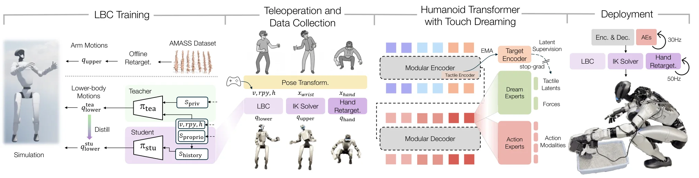

# HTD：基于 Touch Dreaming 的触觉感知人形灵巧操作

HTD 关注真实人形机器人在 **loco-manipulation + dexterous manipulation + contact-rich interaction** 中的稳定控制与触觉建模问题。整套系统并不是让一个策略直接控制所有电机，而是先训练稳定的下半身控制器，再通过 VR 遥操作采集带有视觉、状态、力觉和触觉的真实示范，最后训练 HTD 根据当前多模态观测预测未来高层动作。Touch Dreaming 只作为训练时的辅助预测目标，用于迫使共享 Transformer 学习接触相关表示；部署时只保留动作输出分支。

<div class="paper-overview" markdown>

{ loading=lazy }

<span class="paper-overview__caption">图：HTD 从 LBC teacher–student 训练、VR 遥操作采集，到 Touch Dreaming 策略学习与真机部署的完整流程。图片来自论文官方版本。</span>

</div>

<!-- more -->

## 论文信息

- **论文：** [Learning Versatile Humanoid Manipulation with Touch Dreaming](https://arxiv.org/abs/2604.13015)
- **作者：** Yaru Niu, Zhenlong Fang, Binghong Chen, Shuai Zhou, Revanth Krishna Senthilkumaran, Hao Zhang, Bingqing Chen, Chen Qiu, H. Eric Tseng, Jonathan Francis, Ding Zhao
- **机构：** Carnegie Mellon University, UT Arlington, Bosch Center for AI
- **版本：** arXiv:2604.13015v3, 2026-08-17
- **会议：** IROS 2026
- **项目主页：** [Humanoid Touch Dream](https://humanoid-touch-dream.github.io/)
- **代码：** [chrisyrniu/humanoid-touch-dream](https://github.com/chrisyrniu/humanoid-touch-dream)

## 1. 研究背景

现有 humanoid manipulation 系统通常分别解决 whole-body control、灵巧手遥操作或 tactile sensing，但较少同时满足：

```text
稳定的 Whole-Body Execution
+
Full Dexterous-Hand Control
+
Distributed Tactile Sensing
+
Touch Modeling
```

仅使用视觉和 proprioception 的 Behavioral Cloning 在接触密集型任务中容易受到部分可观测性的影响，例如插入时是否碰到边缘、抓取是否滑动、手指受力是否异常，这些信息很难只从图像中准确恢复。

HTD 的核心思路不是构造一个推理时使用的 tactile world model，而是在行为克隆过程中增加：

```text
Future Hand Joint Force Prediction
+
Future Tactile Latent Prediction
```

作为辅助训练目标，使共享 Transformer 主干学习 contact-aware representation。

---

## 2. 整体系统框架

论文将系统分成四个阶段：

```text
Stage I：Lower-Body Controller Training
IsaacLab Simulation
        ↓
PPO Teacher
        ↓
DAgger Student
        ↓
Deployable LBC

Stage II：VR Teleoperation and Data Collection
Human VR + Joystick
        ↓
LBC + IK + Hand Retargeting
        ↓
真实机器人执行
        ↓
Multimodal Humanoid Demonstrations

Stage III：HTD Policy Training
Vision + Proprioception + Force + Tactile
        ↓
Multimodal Encoder–Decoder Transformer
        ↓
Action Chunk Prediction
+
Future Force / Tactile-Latent Prediction
        ↓
Behavioral Cloning + Touch Dreaming
        ↓
HTD Checkpoint

Stage IV：Deployment
Current Multimodal Observation
        ↓
HTD Action Experts
        ↓
LBC + IK + Hand Retargeting
        ↓
Whole-Body Robot Execution
        ↓
New Observation
        ↓
Closed-Loop Inference
```

LBC 与 HTD **不是端到端联合训练**。LBC 先独立训练并固定，之后用于 VR 数据采集和最终 HTD 部署。

---

## 3. Stage I：Lower-Body Controller Training

### 3.1 Stage I 流程

```text
────────────────────────────────
Teacher LBC Training
────────────────────────────────

随机采样控制命令
Velocity：[vx, vy, ωz]
Orientation：[roll, pitch, yaw]
Height：base height
        │
        │
AMASS Human Motion
        ↓
Offline Arm Retargeting
        ↓
在仿真中回放 Upper-Body Arm Motion
制造真实操作时的惯性 / 重心扰动
        │
        ▼
IsaacLab 当前状态
│
├── Proprioception s_proprio
├── Privileged Foot Contact c_feet
└── Command (v, rpy, h)
        ↓
Teacher Policy
        ↓
15-DoF Lower-Body Joint Targets q_lower^T
        ↓
仿真机器人执行
        ↓
Tracking / Stability / Gait / Contact Reward
        ↓
PPO Update
        ↓
Trained Teacher LBC

────────────────────────────────
Student LBC Distillation
────────────────────────────────

Student 自己在仿真中 Rollout
        ↓
当前 Student 造成的状态 s_t
        │
        ├──→ Student：
        │    s_proprio + 2-step history + command
        │            ↓
        │       q_lower^S
        │
        └──→ Teacher：
             s_proprio + c_feet + command
                     ↓
                q_lower^T
        ↓
L2(q_lower^S, q_lower^T)
        ↓
Backpropagation
        ↓
DAgger Student LBC
```

### 3.2 LBC 的输入与输出

LBC 只负责腿和腰，不负责手臂与灵巧手。

当前 proprioception 为：

$$
s_{\mathrm{proprio}}^t
=
[
\omega^t,\,
g^t,\,
q_{\mathrm{lower}}^t,\,
\dot q_{\mathrm{lower}}^t,\,
a_{\mathrm{lower}}^{t-1}
]
$$

其中包含 base angular velocity、projected gravity、下半身关节位置与速度，以及上一步动作。

控制命令包括：

```text
Base Velocity：
vx, vy, ωz

Torso Pose：
roll, pitch, yaw

Base Height：
h
```

Teacher 额外输入仿真中可直接得到的双脚接触状态：

$$
c_{\mathrm{feet}}\in\{0,1\}^{2}
$$

Teacher 和 Student 都输出：

$$
q_{\mathrm{lower}}\in\mathbb{R}^{15}
$$

其中：

```text
Left Leg：6 DoF
Right Leg：6 DoF
Waist：3 DoF
```

输出是 **target joint positions**，不是裸电机电流或 torque。

### 3.3 Teacher：PPO 强化学习

Teacher 没有“正确的 15 维关节动作标签”。策略先输出动作，仿真执行，再根据结果获得 reward：

```text
Current State + Command
        ↓
Teacher Policy
        ↓
q_lower^T
        ↓
Simulation
        ↓
跟踪是否准确 / 是否稳定 / 是否摔倒
        ↓
Reward
        ↓
PPO 更新策略
```

Reward 主要分为：

| Reward Group | 作用 |
|---|---|
| Tracking | 跟踪平面速度、yaw rate、torso height、roll、pitch、yaw |
| Regularization | 限制能耗、动作突变、关节加速度、身体振荡 |
| Contact & Gait | 限制脚滑、异常碰撞、腾空、过大地面反力等 |
| Stability | 保持身体稳定、关节不过限、双脚距离合理 |
| Termination | 跌倒或不可恢复状态给予较大惩罚 |

其中 tracking rewards 的权重均为 1.0，episode termination penalty 为 -200。

训练命令范围为：

| Command | Range |
|---|---:|
| $v_x$ | $[-0.5,0.5]$ m/s |
| $v_y$ | $[-0.5,0.5]$ m/s |
| $\omega_z$ | $[-1.57,1.57]$ rad/s |
| torso roll | $[-0.7,0.7]$ rad |
| torso pitch | $[-0.52,1.57]$ rad |
| torso yaw | $[-1.57,1.57]$ rad |
| base height | $[0.35,0.8]$ m |

训练还进行 **Domain Randomization**，例如随机化 friction、base mass、joint position / velocity 和 angular velocity，使 Student 更容易从仿真迁移到真机。

AMASS 在这里不是提供 HTD 的操作数据。作者只将其中的 arm motions 重定向到机器人并在 LBC 训练时回放，使下半身策略在上半身持续运动和产生扰动时仍能稳定跟踪命令。

### 3.4 Student：DAgger 蒸馏

Student 不能使用仿真的 foot-contact privileged information，因此输入改成：

```text
Current Proprioception
+
2-Step Proprioceptive History
+
(v, rpy, h)
```

2-step history 用于缓解 partial observability，例如根据最近状态变化间接判断当前步态阶段和支撑状态。

DAgger 的关键是让 Student **执行自己的动作进入环境**，Teacher 只在 Student 当前到达的状态上提供参考动作：

$$
L_{\mathrm{LBC}}
=
\left\|
q_{\mathrm{lower}}^S
-
q_{\mathrm{lower}}^T
\right\|_2^2
$$

这样 Student 学到的不只是 Teacher 正常轨迹上的动作，也包含自己产生小偏差后应如何恢复。

Stage I 最终保留 **Student LBC**。Teacher 只用于仿真训练，不参与 HTD 数据采集和真机部署。

---

## 4. Stage II：VR Teleoperation and Data Collection

### 4.1 Stage II 流程

```text
Human VR Motion + Joystick
        │
        ├─────────────────────────────────────┐
        │                                     │
        ▼                                     ▼
Head / Wrist / Hand Motion             Joystick
        ↓                                     ↓
Transform to Unified Robot Frame       Base Velocity v
        │
        ├── Torso Pose (rpy, h)
        │          ↓
        │     Student LBC
        │          ↓
        │      q_lower
        │
        ├── 6D Wrist Pose x_wrist
        │          ↓
        │       IK Solver
        │          ↓
        │       q_upper
        │
        └── Human Hand Target x_hand
                   ↓
             DexPilot Retargeting
                   ↓
                q_hand
        │
        └──────────────┬──────────────┘
                       ↓
                Humanoid Execution
                       ↓
────────────────────────────────
同步记录 Multimodal Demonstration
────────────────────────────────

Head RGB + Wrist RGB
Robot / Hand Proprioception
Per-Joint Hand Force
Left / Right Hand Tactile
+
Action Command
(v, rpy, h, x_wrist, x_hand)
        ↓
HTD Training Dataset
```

### 4.2 人类输入如何变成机器人动作

VR 系统将人的 head、wrist 和 hand motion 统一转换到 robot reference frame。

#### 下半身与躯干

```text
(v, rpy, h)
        ↓
Student LBC
        ↓
q_lower
```

LBC 负责稳定 locomotion、躯干姿态和高度。

#### 手臂

```text
Desired Wrist / End-Effector Pose x_wrist
        ↓
Inverse Kinematics
        ↓
Upper-Body Joint Target q_upper
```

IK 的作用是根据“希望手腕到哪里、朝向哪里”反求手臂关节配置。

#### 灵巧手

```text
Human Hand Target x_hand
        ↓
DexPilot-Based Retargeting
        ↓
Dexterous Hand Joint Target q_hand
```

DexPilot 通过优化 human hand 与 robot hand 的 fingertip-distance consistency，将人手动作映射到机器手。

### 4.3 一条示范数据记录什么

数据采集过程中同步记录：

```text
Observation o_t
│
├── Dual-Lens Head RGB
├── Wrist RGB
├── Robot / Hand Proprioception
├── Per-Joint Hand Force
└── Distributed Tactile

Action a_t
│
├── Base Velocity v
├── Torso Pose rpy
├── Base Height h
├── Wrist Pose Target x_wrist
└── Hand Target x_hand
```

这里 HTD 要模仿的是 **人类给 LBC / IK / Hand Retargeting 的高层动作目标**，不是直接模仿所有电机的底层控制量。

每只手的 tactile observation 为 **1062 维**，分布在 17 个空间 sensing regions。按解剖区域可进一步拆成：

```text
Thumb：210-D
Index / Middle / Ring / Pinky：185-D each
Palm：112-D
```

Stage II 不训练 HTD，也没有 loss；它的作用是建立后续行为克隆使用的真实机器人示范数据集。

---

## 5. Stage III：HTD Policy Training

### 5.1 Stage III 流程

```text
从示范轨迹采样时刻 t
        ↓

Current Observation o_t
│
├── Head Images
├── Wrist Images
├── Robot / Hand Pose Proprioception
├── Current Hand Joint Force
└── Current Finger / Palm Tactile
        │
        ▼
────────────────────────────────
Modality Tokenization
────────────────────────────────

Images
→ Pretrained ResNet
→ Visual Features
→ Cross-Attention Slot Tokenizer

State / Force
→ MLP Feature Extractor
→ Cross-Attention Slot Tokenizer

Raw Tactile
→ Per-Finger / Region Tactile Encoder
→ Tactile Features
→ Cross-Attention Slot Tokenizer
        │
        └───────────────┐
                        ↓
              Fixed Multimodal Tokens
                        ↓
              Transformer Encoder
                        ↓
              Shared Fused Context
                        ↓
              Transformer Decoder
                        ↓
               Fixed Output Tokens
        ┌───────────────┴────────────────┐
        ▼                                ▼
─────────────────                 ─────────────────
Action Experts                    Dream Experts
─────────────────                 ─────────────────
EE Pose Chunk                     Future Hand Forces
Torso Pose Chunk                  Future Tactile Latents
Velocity Chunk
Hand Action Chunk
        │                                │
        ▼                                │
GT Human Action Chunk                    │
        │                                │
        │                     GT Future Tactile
        │                                ↓
        │                       EMA Target Encoder
        │                                ↓
        │                        Target Latents z*
        │                                │
        ├──────────────┬─────────────────┘
        │              │
        ▼              ▼
Action Loss       Touch Dreaming Loss
        └──────┬───────┘
               ↓
           Total Loss
               ↓
        Backpropagation
               ↓
        Update HTD Student
               ↓
          EMA Update
               ↓
         HTD Checkpoint
```

### 5.2 Training Sample

论文将一条训练 sample 写成：

$$
D=
\{
(o_t,\,
A_t,\,
F_{t:t+\tau},\,
S_{t:t+\tau})
\}
$$

其中：

- $o_t$：当前多模态 observation；
- $A_t$：长度为 $h$ 的 future action chunk；
- $F_{t:t+\tau}$：未来 hand joint force sequence；
- $S_{t:t+\tau}$：未来 raw tactile sequence。

动作 chunk 为：

$$
A_t=
\{a_{t+\ell}\}_{\ell=1}^{h}
$$

每个 action 对应前面数据采集时记录的高层 action modalities：

```text
End-Effector Pose
Torso Pose / Height
Velocity Command
Hand Action
```

论文没有给出 action chunk horizon $h$ 和 touch dreaming horizon $\tau$ 的具体数值。

### 5.3 Modality Tokenizers

HTD 不直接把所有 raw inputs 拼成一个长向量，而是先针对不同模态提取特征，再统一压缩成固定数量的 tokens。

```text
Raw Modality
      ↓
Modality-Specific Feature Extractor
      ↓
Feature Sequence
      ↓
Learnable Slot Queries
      │
      └── Cross-Attention
              ↓
       Fixed Number of Tokens
```

Cross-attention 中，learnable slot token 作为 Query，原始 feature sequence 提供 Key / Value。每个 slot 根据与各 feature 的相关性进行加权汇聚，因此无论原始 feature sequence 多长，都可以得到固定数量的 token。

### 5.4 Visual / State Encoding

图像使用 **pretrained ResNet** 提取特征，并在 HTD 训练中继续 finetune。Head camera 与不同 wrist cameras 使用独立 tokenizer。

State-like modalities，例如 robot / hand pose、proprioception 与 force-related proprioception，使用轻量 **MLP** 提取特征。

### 5.5 Per-Finger / Region Tactile Encoder

触觉不是先把整只手压成一个向量，而是按手指和手掌分别编码。

```text
Raw Tactile
        ↓
Thumb / Index / Middle / Ring / Pinky / Palm
        ↓
每个区域继续切成 Local Patches

Regular Finger 185-D
→ Tip / Top / Palm-Facing

Thumb 210-D
→ Tip / Top / Mid / Palm-Facing

Palm 112-D
→ One Large Patch
        ↓
Reshape Patch to 2D Map
        ↓
CNN Branch
        ↓
Adaptive Pooling
        ↓
Flatten
        ↓
Concatenate Local Patch Features
        ↓
MLP Fusion
        ↓
Per-Finger / Region Embedding
        ↓
Project to Transformer Hidden Dimension
        ↓
Cross-Attention Tokenization
```

较小 patch 使用 single-layer convolution，较大 patch 使用 two-layer CNN block。

这里的 tactile encoder 是 **可学习网络**。当前 tactile 经过 Student tactile encoder 后参与动作与 dreaming prediction，反向传播会更新其中的 CNN / MLP 参数，因此 latent space 也会随着训练逐渐形成，而不是预先固定。

### 5.6 Transformer Trunk 与 Modular Experts

所有 modality tokens 按固定顺序拼接后进入 Transformer Encoder：

```text
Visual Tokens
+ State Tokens
+ Force Tokens
+ Tactile Tokens
        ↓
Transformer Encoder
        ↓
Multimodal Contextual Representation
```

Encoder 的作用是让不同模态互相读取信息，例如视觉观察到手已经靠近杯子，同时 tactile token 表明拇指已经接触，force token 表明当前抓握力正在增加。

Transformer Decoder 再产生一组固定 output tokens。不同动作模态分配独立输出位置，并由各自的 **Action Expert** 读取：

```text
Output Tokens
├── EE Pose Expert
├── Torso Pose Expert
├── Velocity Expert
└── Hand Action Expert
```

这样低维但关键的 velocity command 不会被埋在一个很大的 monolithic action vector 中。

Dream Experts 则读取整组 decoder output tokens，预测：

```text
Future Hand Joint Forces
+
Future Finger / Region Tactile Latents
```

Dream Experts 只用于训练。

### 5.7 EMA Target Encoder

Future tactile latent 的监督目标不是固定人工标签，而是由一个缓慢更新的 **EMA tactile encoder** 生成。

```text
Student Tactile Encoder
参数 θ
        │
        │ Gradient Update
        ▼
新的 θ
        │
        └── EMA ────────────────┐
                                ↓
                     Teacher Parameters θ^T

真实 Future Tactile S_{t+k}
        ↓
EMA Teacher Tactile Encoder
        ↓
Target Latent z*
        ↓
stop-gradient
```

EMA 更新为：

$$
\theta^T
\leftarrow
\alpha\theta^T
+
(1-\alpha)\theta
$$

真实未来 tactile measurement 是固定数据，但其 latent representation 会随着 EMA Teacher 缓慢变化。

EMA Teacher 不进行 backpropagation。它的作用是给 tactile prediction 提供 slow-moving target，避免 Student tactile encoder 与 touch decoder 同时快速变化并坍塌到“所有触觉都输出近似相同 latent”的无意义解。

### 5.8 Stage III Loss

总损失为：

$$
L
=
\sum_i L_{\mathrm{act},m_i}
+
\lambda_F L_{\mathrm{force}}
+
\lambda_Z L_{\mathrm{tact}}
$$

#### Action Behavior-Cloning Loss

每个 action modality 都预测长度为 $h$ 的 action chunk，并与 VR demonstration 中记录的 future action 比较：

$$
L_{\mathrm{act},m_i}
=
\frac{1}{h}
\sum_{\ell=1}^{h}
\operatorname{SmoothL1}
\left(
a_{t+\ell}[m_i],
\hat a_{t+\ell}[m_i]
\right)
$$

#### Future Hand Joint Force Loss

$$
L_{\mathrm{force}}
=
\frac{1}{\tau}
\sum_{k=1}^{\tau}
\operatorname{SmoothL1}
(
\hat f_{t+k},
f_{t+k}
)
$$

#### Future Tactile Latent Loss

先用 EMA Teacher 编码真实未来触觉：

$$
z_{t+k}^{*}
=
\operatorname{stopgrad}
\left(
T_{\mathrm{tact}}^{T}(s_{t+k})
\right)
$$

再让 Dream Expert 的预测 $\hat z$ 同时匹配 latent 的方向和 magnitude：

$$
L_{\mathrm{tact}}
=
1-\cos(\hat z,z^*)
+
\beta\,
\operatorname{SmoothL1}
\left(
\|\hat z\|-\|z^*\|
\right)
$$

Cosine term 约束 latent 的方向相似；magnitude term 继续约束向量大小，避免模型只通过归一化方向满足 cosine similarity。

Stage III 是 **single-stage Behavioral Cloning**。Tactile encoder 不需要先单独预训练，HTD Student 中的 tokenizers、Transformer trunk 和 output experts 一起通过总损失更新；EMA Teacher 只通过移动平均更新。

---

## 6. Stage IV：Deployment

### 6.1 Stage IV 流程

```text
Current Real-Robot Observation
│
├── Head Images
├── Wrist Images
├── Robot / Hand Proprioception
├── Current Hand Joint Force
└── Current Tactile
        ↓
HTD Modality Tokenizers
        ↓
Transformer Encoder
        ↓
Transformer Decoder
        ↓
Action Experts Only
        ↓
Future Action Chunk
│
├── Velocity Command v
├── Torso Pose / Height (rpy, h)
├── Wrist / EE Pose x_wrist
└── Hand Target x_hand
        │
        ├── (v, rpy, h)
        │       ↓
        │   Student LBC
        │       ↓
        │    q_lower
        │
        ├── x_wrist
        │       ↓
        │    IK Solver
        │       ↓
        │    q_upper
        │
        └── x_hand
                ↓
          Hand Retargeting
                ↓
             q_hand
        │
        └──────────────┬──────────────┘
                       ↓
             Robot Low-Level Control
                       ↓
                 Physical Execution
                       ↓
                  New Observation
                       ↓
                 Next HTD Inference
```

### 6.2 部署时保留与删除的模块

部署时保留：

```text
Current Tactile Input
Modality Tokenizers
Transformer Encoder / Decoder
Action Experts
Student LBC
IK Solver
Hand Retargeting
```

部署时不再使用：

```text
LBC Teacher
EMA Tactile Teacher
Future Force Dream Expert
Future Tactile Dream Expert
GT Future Touch
Training Loss
Backpropagation
```

这里需要区分：

> **未来 tactile dreaming 在推理时被删除，但“当前触觉”仍然是 HTD 的实时输入。**

因此 HTD 仍是 tactile-conditioned policy，只是不把 dreamed future touch 作为在线规划或控制信号。

论文中 HTD 以 **30 Hz** 输出 action chunks，LBC、IK 和 hand retargeter 以 **50 Hz** 运行。论文没有进一步说明 action chunk 的具体长度、每轮执行多少步以及多个连续 chunk 的 blending / scheduling 方式。

### 6.3 闭环执行

HTD 的自主执行是：

```text
Observation o_t
        ↓
HTD
        ↓
Action Chunk A_t
        ↓
LBC + IK + Retargeting
        ↓
Robot Execution
        ↓
环境与接触发生变化
        ↓
New Observation o_t+1
        ↓
再次 HTD Inference
```

所以它不是任务开始时一次性生成完整动作轨迹，而是在执行过程中持续读取新的视觉、状态、力觉和触觉。

论文给出的 HTD 输入中 **没有 language / text task instruction**，正文也没有明确说明五个实验任务是否由同一个 checkpoint 联合完成还是分别训练 task policy。因此不能把它理解成“机器人看到毛巾后从开放任务集合中自动理解应该叠毛巾”；论文只证明策略在预先设定的五类实验任务场景中可以自主闭环执行。

---

## 7. 核心模型与算法原理

### 7.1 PPO

PPO 是强化学习算法。Teacher LBC 没有逐状态的标准动作，而是：

```text
State + Command
        ↓
Policy Action
        ↓
Simulation
        ↓
Reward
```

策略通过提高高长期回报动作的概率来学习。

PPO 的 **clipping** 思想是在使用旧策略采集数据后，限制新策略一次更新不要偏离旧策略过多，避免因为一批 rollout 中的偶然高 reward 导致策略发生过大的参数变化。Teacher 因此可以逐步学到稳定跟踪速度、躯干姿态和高度的动作，而不需要人工提供每个关节的正确答案。

### 7.2 DAgger

DAgger 属于 imitation learning。Student 不是 PPO 策略的“修改版”，而是：

```text
Student 自己 Rollout
        ↓
进入 Student 自己造成的状态
        ↓
Teacher 在这个状态给 Reference Action
        ↓
Supervised L2 Loss
        ↓
Update Student
```

关键价值是缓解 covariate shift：Student 部署时经历的是自己动作造成的状态分布，而不是 Teacher 的完美状态分布。

### 7.3 Inverse Kinematics

Forward Kinematics 是：

```text
Joint Angles q
        ↓
Robot Kinematics
        ↓
End-Effector Pose x
```

IK 做反方向求解：

```text
Desired End-Effector Pose x*
        ↓
求解 q
        ↓
使当前末端位姿接近目标位姿
```

因此人类只需要给出希望 wrist 到达的位置和朝向，不需要手工决定肩、肘各个关节转多少。

### 7.4 CNN 与 Tactile Patch Encoding

二维卷积使用一个小 kernel 在 tactile map 上滑动：

```text
Local Tactile Patch
        ↓
3×3 / Similar Local Kernel
        ↓
每个位置做加权求和
        ↓
Local Feature Map
```

同一组 kernel 参数在不同空间位置共享，因此特别适合提取局部空间模式，例如：

- 一个小区域突然受力；
- 接触从 fingertip 向侧面移动；
- 一片连续 taxels 同时激活。

Adaptive Pooling 再把不同 patch size 的 feature map 压到固定空间尺寸，使后续 MLP 可以统一处理。

### 7.5 ResNet

ResNet 仍由多层 convolution 组成，但增加 residual connection：

$$
y=F(x)+x
$$

主分支 $F(x)$ 学习新的视觉特征，shortcut 直接保留原输入。这样深层网络更容易优化。HTD 使用 pretrained ResNet 处理 head / wrist images，并在策略训练中继续 finetune，使视觉特征适应真实机器人操作场景。

### 7.6 Cross-Attention Tokenization

Cross-attention 的基本形式为：

$$
\operatorname{Attention}(Q,K,V)
=
\operatorname{softmax}
\left(
\frac{QK^T}{\sqrt d}
\right)V
$$

在 HTD tokenizer 中：

```text
Q：Learnable Slot Tokens
K：Modality Feature Sequence
V：Modality Feature Sequence
```

每个 slot 根据相关性从整组 features 中聚合信息。它相当于让少量固定的“信息槽”主动去读取原始 feature sequence，从而得到固定数量的 tokens。

### 7.7 Encoder–Decoder Transformer

Encoder 接收所有 observation tokens，通过 self-attention 让视觉、状态、force 和 tactile information 相互交互。

Decoder 再以固定输出 positions 从 Encoder representation 中读取信息，形成供不同 Action / Dream Experts 使用的 output tokens。

因此整体可以理解为：

```text
Encoder：
理解当前多模态状态

Decoder：
为不同输出任务准备结构化表示

Experts：
把对应表示转换成实际动作或辅助预测
```

### 7.8 Action Chunking

普通一步预测为：

```text
o_t → a_t
```

Action Chunking 为：

```text
o_t → [a_t, a_t+1, ..., a_t+h-1]
```

一次输出一小段连续动作，可以增强短时序动作的一致性，也减少每一步独立预测带来的高频抖动。HTD 对不同 action modalities 都采用 chunk prediction，但论文没有给出 $h$ 的具体数值。

### 7.9 Smooth L1

Smooth L1 在误差较小时近似平方误差，在误差较大时转为线性增长。相比纯 MSE，它不会让少量异常大误差产生过大的梯度，因此适合连续动作、force 等回归任务。

### 7.10 EMA Self-Distillation

EMA Teacher 不通过梯度学习，而是慢慢跟随 Student：

```text
Student：
快速通过 Backprop 学习表示

EMA Teacher：
缓慢吸收 Student 参数
        ↓
提供较稳定的 Latent Target
```

它的作用不是提供一个永远固定的人工标签，而是构造 **slow-moving representation target**，使 tactile latent 能在训练过程中逐步形成，同时减少表示坍塌风险。

---

## 8. 实验与消融

### 8.1 五个真实机器人任务

论文测试五类 contact-rich humanoid manipulation：

| Task | 主要能力 |
|---|---|
| Insert-T | 3.5 mm 紧公差插入与接触纠偏 |
| Book Organization | 推 + 抓 + 放置薄型刚体 |
| Towel Folding | 长时序可变形物体操作 |
| Cat Litter Scooping | 下蹲、工具操作、受限空间接触 |
| Tea Serving | 双手抓取、移动、停止与放置的 loco-manipulation |

每种方法、每个任务进行 20 次 real-world trials，统计 strict success rate 和 partial task score。

HTD 相比每个任务中表现更强的 ACT baseline，平均成功率提高 **30.0 个百分点**，相对提升约 **90.9%**；平均任务得分提高 **17.9 个百分点**，相对提升约 **31.1%**。

仅把 touch 直接加入 ACT 输入并不能稳定提升所有任务，说明 tactile input 本身并不保证策略真正学会利用接触信息。

### 8.2 Touch Dreaming Ablation

论文比较四种版本：

| Variant | Touch Input | Future Touch Prediction |
|---|---:|---|
| w/o Touch and TD | ✗ | ✗ |
| w/o TD | ✓ | ✗ |
| Dream Raw Tactile | ✓ | Raw Tactile |
| Dream Latent Tactile | ✓ | EMA Latent |

主要结论：

1. **Touch Input Alone 不稳定。** 加触觉但不加 dreaming，在部分任务改善，在部分任务无提升甚至略差。
2. **Predictive Touch Objective 有效。** Raw 与 latent dreaming 都优于只输入当前 touch。
3. **Latent Prediction 最好。** Dream Latent Tactile 相比 Dream Raw Tactile 的平均 success rate 有约 30% relative gain。

原因是 raw tactile 高维、稀疏且噪声较大；latent supervision 更集中地保留 contact structure。

### 8.3 Touch Dreaming Visualization

Tea Serving 和 Towel Folding 的 rollout 中，预测的 future hand forces 能较好跟踪真实接触事件的时间与强度，predicted tactile latent 与 EMA target latent 在持续接触阶段保持较高相似度。

在突然发生 contact transition 时，相似度会下降。论文解释主要有两点：

```text
Dreamed Touch Chunk 是 Open-Loop Prediction
→ chunk 中途突然发生不可预测接触时会偏离

Raw Tactile 本身存在噪声和局部弱响应
→ EMA Latent 更倾向保留语义接触结构
```

---

## 9. LBC 实验结果

LBC 与 FALCON、AMO 进行仿真跟踪比较，在大部分速度、身体高度和 torso orientation 指标上取得更低误差。

其仿真最大稳定控制范围为：

| Command | Stable Range |
|---|---:|
| Base Height | $[0.33,0.80]$ m |
| Torso Roll | $[-0.38,0.35]$ rad |
| Torso Pitch | $[-0.92,1.41]$ rad |
| Torso Yaw | $[-1.50,1.34]$ rad |

Roll 的稳定范围明显比训练命令范围窄，说明 lateral whole-body balance 仍是更受限制的方向。

---

## 10. 推理流程总结

最终部署不是 HTD 直接控制所有关节，而是一个分层闭环系统：

```text
────────────────────────────────
High-Level Policy
────────────────────────────────

Current Vision
Current Proprioception
Current Hand Joint Force
Current Tactile
        ↓
HTD
        ↓
Future High-Level Action Chunk
(v, rpy, h, x_wrist, x_hand)

────────────────────────────────
Execution Stack
────────────────────────────────

(v, rpy, h)
→ Student LBC
→ Lower-Body Joint Targets

x_wrist
→ IK Solver
→ Upper-Body Joint Targets

x_hand
→ Hand Retargeting
→ Dexterous-Hand Joint Targets

────────────────────────────────
Robot
────────────────────────────────

q_lower + q_upper + q_hand
        ↓
Robot Low-Level Joint Control
        ↓
Physical Motion / Contact
        ↓
New Observation
        ↓
HTD Re-Inference
```

训练阶段的 Future Force Prediction、Future Tactile Latent Prediction 和 EMA Teacher 都不会进入这条部署链。

HTD 的作用更接近：

> 根据当前多模态状态，学习复现 VR 操作员原本会给出的高层 whole-body commands。

LBC、IK 与 hand retargeting 再负责把这些高层命令变成具体身体、手臂与灵巧手关节目标。

---

## 11. 论文结论

HTD 的完整贡献来自三个层面的组合：

```text
Robust Lower-Body Controller
        ↓
解决操作时的 whole-body stability

VR + Dexterous Hand + Tactile Data Collection
        ↓
建立真实 contact-rich humanoid demonstrations

HTD + Touch Dreaming
        ↓
通过 Future Force / Tactile Latent Prediction
学习 Contact-Aware Representation
```

实验表明，单纯把 tactile observation 拼进策略输入并不足以稳定提升操作性能；更有效的方法是要求策略学习预测未来接触，使 tactile information 真正约束共享 representation。

Touch Dreaming 的定位需要特别明确：它不是独立 world model，也不在推理时生成未来 tactile 后再规划动作，而是训练阶段的 auxiliary objective。部署仍保持简单的单策略闭环，通过当前视觉、状态、力觉和触觉直接预测 action chunk。

因此这篇工作的核心结论可以归纳为：**稳定的全身执行框架解决“动作能不能做出来”，真实触觉数据解决“接触能不能被观测”，Touch Dreaming 则解决“策略是否真正学习到接触动态”。三者结合后，才能在插入、工具操作、可变形物体处理和双手 loco-manipulation 中获得稳定提升。**
