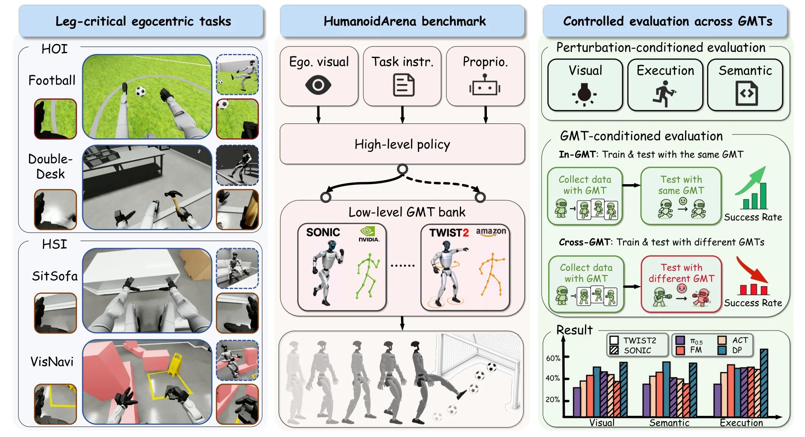

# HumanoidArena：第一视角层级式全身人形学习基准

HumanoidArena 不是一个新的 whole-body policy，而是一套面向 **egocentric hierarchical whole-body learning** 的仿真 Benchmark。它统一高层策略的视觉、语言、本体状态输入和 40D whole-body action 输出，再由 SONIC 或 TWIST2 等低层 General Motion Tracker（GMT）执行，从而能够分别研究高层策略能力、低层执行能力以及二者之间的兼容性。

<div class="paper-overview" markdown>

{ loading=lazy }

<span class="paper-overview__caption">图：HumanoidArena 的 leg-critical HOI/HSI 任务、共享高层策略—GMT 接口，以及 perturbation / cross-GMT 评测框架。图片来自论文官方版本。</span>

</div>

<!-- more -->

论文原文没有按照 Stage I / II / III 命名训练阶段。为了把系统流程整理清楚，本文按实际数据流重新划分为四个 Stage：

```text
Stage I：Benchmark Task & Hierarchical Interface
7 个 leg-critical HOI / HSI tasks
+
统一 64D state / 40D action interface
        ↓

Stage II：Multi-GMT Demonstration Collection
VR egocentric teleoperation
→ GMR retargeting
→ TWIST2 / SONIC execution
→ 记录成功 demonstration
        ↓

Stage III：High-Level Policy Training
RGB + proprioception + language
        ↓
ACT / Diffusion Policy / Flow Matching / π0.5
        ↓
Future 20 × 40D whole-body action chunk
        ↓

Stage IV：Controlled Evaluation
In-GMT / Cross-GMT
+
Visual / Semantic / Execution perturbation
        ↓
Success Rate / Fall Rate / Transfer Retention
```

---

## 论文信息

- **论文：** [HumanoidArena: Benchmarking Egocentric Hierarchical Whole-body Learning](https://arxiv.org/abs/2606.17833)
- **作者：** Taowen Wang, Zikang Xie, Bin Yang, Yunheng Wang, Zizhao Yuan, Yuetong Fang, Yixiao Feng, Yichi Wang, Xingyu Chen, Haodong Chen, Qiwei Wu, Weisheng Xu, Lihan Chen, Lusong Li, Zecui Zeng, Renjing Xu
- **机构：** HKUST (Guangzhou), Beijing University of Technology, Harbin Institute of Technology (Shenzhen), Shenzhen MSU-BIT University, JD Explore Academy
- **版本：** arXiv:2606.17833v1, 2026-06-16
- **机器人：** Unitree G1
- **仿真平台：** Isaac Lab
- **低层 GMT：** TWIST2、SONIC
- **高层 Baseline：** ACT、Diffusion Policy、Flow Matching、π0.5
- **项目主页：** [HumanoidArena](https://humanoidarena.github.io/)
- **代码：** [William-wAng618/HumanoidArena](https://github.com/William-wAng618/HumanoidArena/tree/release/open-source-prep)
- **数据与模型：** [Dataset](https://huggingface.co/datasets/WilliamWang16/HumanoidArena_dataset_v3_1) · [Checkpoints](https://huggingface.co/WilliamWang16/HumanoidArena_models)

---

## 1. 研究背景与 Benchmark 定位

现有 humanoid whole-body 系统通常同时包含：

```text
视觉 / 语言理解
        ↓
任务级决策
        ↓
Whole-body Action
        ↓
动态平衡与运动跟踪
```

如果不同工作使用不同的高层策略、动作表示和低层控制器，最终成功率很难说明究竟是哪一部分更好。

HumanoidArena 因此固定一套共享接口：

```text
High-Level Policy
输入：
Egocentric RGB
+
Task Instruction
+
64D Proprioception

输出：
40D Canonical Whole-Body Action
        ↓
GMT-specific Adapter
        ↓
SONIC / TWIST2
        ↓
Stable Humanoid Motion
```

Benchmark 的主要创新不是提出新的网络结构，而是把 **policy–tracker interface** 本身变成评测对象。

任务也专门选择了必须依赖腿部参与的 leg-critical interaction，而不是简单的“走到桌前，再只用手操作”。

| 类型 | 任务 | 主要 lower-body 要求 |
|---|---|---|
| HOI | Football | 接近、支撑脚调整、单腿平衡、摆腿踢球 |
| HOI | DoubleDesk | 持物行走、跨工作空间搬运 |
| HOI | P&PBox | 搬运、屈膝、调整全身姿态完成高处放置 |
| HSI | OpenDoor | 开门接触、转身、边推边穿过门框 |
| HSI | SitSofa | 避障、对齐、屈膝并稳定坐下 |
| HSI | Boxing | 根据目标高度下蹲或伸展 |
| HSI | VisNavi | 障碍导航与精确双脚落点 |

---

## 2. Stage I：Benchmark Task 与 Hierarchical Interface

### 2.1 Stage I 流程

```text
7 个 Leg-Critical Tasks
        ↓
统一机器人 Observation / Action 定义
        ↓
────────────────────────────────
High-Level Policy Interface
────────────────────────────────

Egocentric RGB I_t
+
Task Instruction l
+
64D Proprioception p_t
        ↓
High-Level Policy πθ
        ↓
40D Canonical Whole-Body Action u_t
        ↓
GMT-specific Adapter ψ_m
        ↓
SONIC / TWIST2
        ↓
Executable G1 Joint Targets
```

这一阶段本身不训练模型，而是定义整个 Benchmark 中所有方法必须遵循的共享接口。

---

### 2.2 64D Proprioception

高层策略接收的机器人本体状态为：

```text
Root Orientation in 6D           6D
29 Joint Positions              29D
29 Joint Velocities             29D
-----------------------------------
Total                           64D
```

即：

\[
p_t\in\mathbb{R}^{64}
\]

6D rotation representation 用两个连续的 3D 向量表示旋转，再恢复出正交旋转基。相比 Euler angle，它没有明显的角度跳变；相比 quaternion，也避免了 \(q\) 与 \(-q\) 表示同一旋转带来的表示不连续，更适合作为神经网络输入。

---

### 2.3 40D Canonical Whole-Body Action

高层策略统一输出：

```text
Root XY Delta                    2D
Root Height Target               1D
Root Orientation Target          6D
29 Joint Position Targets       29D
Left / Right Hand Binary         2D
-----------------------------------
Total                           40D
```

即：

\[
u_t\in\mathbb{R}^{40}
\]

这个动作不是 torque，也不是单纯的 walking velocity，而是同时表达：

```text
机器人整体往哪里移动
+
身体保持多高、朝向哪里
+
双腿 / 躯干 / 双臂关节目标
+
左右手开合
```

因此高层策略直接预测 whole-body intent，而低层 GMT 负责把这一目标变成动态可执行的运动。

#### 手部控制

虽然论文使用 `hand` 一词，但真正的 hand action 只有：

```text
Left Hand  : Open / Close
Right Hand : Open / Close
```

因此它不是逐手指控制的灵巧手系统，功能上更接近二值夹爪式控制。

同时，手和身体 **没有拆成两个高层 policy**：

```text
同一个 High-Level Policy
        ↓
38D Body / Root Action
+
2D Hand Open-Close
```

二者作为同一个 40D action 一起学习。

---

### 2.4 GMT Adapter

不同 GMT 原本需要不同的参考动作格式，因此统一 40D action 不能直接送入 SONIC 或 TWIST2。

论文定义：

\[
q_{t+1}^{(m)}
=
G^{(m)}
\left(
\psi_m(u_t)
\right)
\]

其中：

- \(u_t\)：高层策略输出的统一 40D action；
- \(\psi_m\)：第 \(m\) 个 GMT 的 adapter；
- \(G^{(m)}\)：SONIC 或 TWIST2；
- \(q_{t+1}^{(m)}\)：GMT 输出的 G1 joint-position target。

流程可以理解为：

```text
统一 40D Action
        ↓
Adapter
只负责转换到对应 GMT 的 reference format
        ↓
GMT
负责 motion prior + tracking + balance + stabilization
        ↓
G1 Joint Targets
```

Cross-GMT 测试时，高层 policy 和 40D action space 都保持不变，只替换 adapter 与 GMT，因此能够单独观察低层执行后端变化造成的性能差异。

---

## 3. Stage II：Multi-GMT Demonstration Collection

### 3.1 Stage II 流程

```text
Human Operator
戴 PICO Headset
        ↑
Robot Egocentric RGB Stream
        │
        ↓
Human Whole-Body Motion
        ↓
GMR Retargeting
        ↓
35D Robot-Space Reference
mimic_obs
        ↓
Redis Real-Time Stream
        ↓
┌───────────────────────────────┐
│                               │
▼                               ▼
TWIST2 Action Provider       SONIC Action Provider
ONNX Tracking Policy        GEAR-SONIC Encoder/Decoder
│                               │
└──────────────┬────────────────┘
               ↓
       G1 executes in Isaac Lab
               ↓
      Closed-Loop Interaction
               ↓
RecordingManager
               ↓
RGB + 64D State + 40D Action
               ↓
保留 Successful Demonstrations
```

---

### 3.2 Egocentric Closed-Loop Teleoperation

操作者通过 PICO 头显看到机器人第一视角画面，再根据机器人实际执行后的状态持续修正动作：

```text
看当前画面
    ↓
操作者做动作
    ↓
机器人执行
    ↓
场景和机器人姿态变化
    ↓
重新观察
    ↓
继续修正
```

因此采集的不是离线播放的人体轨迹，而是 **robot-in-the-loop closed-loop demonstration**。

数据采集阶段使用一个前方第一视角 RGB，相机分辨率为：

```text
640 × 480
```

论文还支持重新播放 trajectory 生成额外 camera view 和 depth，但主实验训练与推理默认使用 front egocentric RGB。

---

### 3.3 GMR Retargeting

人体和 G1 的骨骼比例、关节自由度以及关节限制不同，因此人体动作不能直接复制给机器人。

GMR 的作用是：

```text
Human Body Motion
        ↓
根据 Robot Kinematics
寻找形态上对应的 Robot Reference Motion
        ↓
35D mimic_obs
```

从算法角度看，retargeting 的核心不是“学习任务”，而是解决 cross-embodiment kinematic mapping：在满足机器人关节和身体结构约束的同时，让机器人姿态尽量保持人体动作的空间关系。

HumanoidArena 本文没有重新展开 GMR 内部优化目标，而是直接把已有 GMR 作为数据采集工具。

---

### 3.4 TWIST2 与 SONIC 的执行差异

两条数据采集链共享同一个上游 35D `mimic_obs`，但低层执行方式不同。

#### TWIST2

```text
35D mimic_obs
        ↓
action_provider_wh_twist2
        ↓
Mimic-style Tracking Command
        ↓
ONNX Tracking Policy
        ↓
G1 Motion
```

#### SONIC

```text
35D mimic_obs
        ↓
action_provider_sonic
        ↓
GEAR-SONIC Encoder / Decoder
Robot Motion Encoder Mode
        ↓
G1 Motion
```

论文特意让 SONIC 使用 robot motion encoder，而不是 human motion encoder，以减少不同操作者身高等因素造成的 retargeting error。

虽然二者接收的是相近的动作意图，但由于 motion prior、稳定策略和接触响应不同，最终会产生：

```text
不同的步幅
不同的身体姿态
不同的平衡修正
不同的相机运动
不同的接触 timing
```

这也是 Cross-GMT distribution shift 的来源。

---

### 3.5 Dataset Format

每个 task：

```text
100 Successful TWIST2 Episodes
+
100 Successful SONIC Episodes
```

因此：

\[
7\times2\times100=1400
\]

共 1,400 条成功 demonstration。

每个 episode 的核心字段为：

```text
Front RGB Sequence
+
64D Canonical State Sequence
+
40D Canonical Action Sequence
```

数据采集和控制统一在：

```text
50 Hz
```

进行。

训练集只保留 successful demonstrations。原始 NPZ 会进一步转换成 LeRobot-compatible dataset。

这一阶段本身没有训练高层 policy，因此没有 high-level learning loss。

---

## 4. Stage III：High-Level Policy Training

### 4.1 Stage III 流程

```text
Successful Demonstration
│
├── Front RGB Sequence
├── 64D Proprioception Sequence
├── Task Instruction
└── 40D Whole-Body Action Sequence
        ↓
从 trajectory 选择当前时刻 t
        ↓

Current RGB I_t
+
Current 64D State p_t
+
Task Instruction l
        │
        │
GT Future Action Chunk
[a_t ... a_t+19]
20 × 40D
        ↓
────────────────────────────────
High-Level Policy
────────────────────────────────

ACT
or Diffusion Policy
or Flow Matching
or π0.5
        ↓
Predicted Future 20 × 40D Action Chunk
        ↓
对应算法的 imitation-learning objective
        ↓
Backpropagation
        ↓
100K Gradient Steps
        ↓
High-Level Policy Checkpoint
```

主实验中的 policy 基本按 task 单独训练；Appendix 另外进行了 Merge-All 实验，把多个 task / GMT 的数据合并训练。

因此主实验里的 language instruction 虽然是模型输入，但任务语言变化不像大规模多任务 VLA 那么丰富。

---

### 4.2 Training Sample

所有 baseline 使用统一的数据接口：

```text
Observation Steps：1

Input:
Current RGB
+
Current 64D Proprioception
+
Task Instruction

Target:
Future 20-Step Action Chunk

Each Action:
40D Canonical Whole-Body Action
```

所以监督目标为：

\[
A_t^*
=
[a_t,a_{t+1},\ldots,a_{t+19}]
\]

其中：

\[
a_k\in\mathbb{R}^{40}
\]

即一次学习未来 20 个 whole-body target，而不是只预测下一帧。

---

### 4.3 四类 High-Level Baseline

| Model | Initialization | Action Chunk | Training Steps | Batch | LR |
|---|---|---:|---:|---:|---:|
| ACT | ResNet-18 | 20 | 100K | 64 | \(1\times10^{-5}\) |
| Diffusion Policy | ResNet-18 | 20 | 100K | 64 | \(1\times10^{-4}\) |
| Flow Matching | CLIP ViT-B/16 | 20 | 100K | 64 | \(2\times10^{-5}\) |
| π0.5 | π0.5 Base Checkpoint | 20 | 100K | 64 | \(2.5\times10^{-5}\) |

ACT、Diffusion Policy 和 Flow Matching 的 RGB 输入 resize / padding 到：

```text
224 × 224
```

π0.5 使用自身 image transform。

论文 Table S6 只明确写出了 Flow Matching baseline 的 objective 为 `Flow matching`；ACT、Diffusion Policy 和 π0.5 的具体 loss 公式没有在 HumanoidArena 中重新展开。因此下面的算法部分将论文确定的信息与这些方法的标准原理分开说明。

---

## 5. Stage IV：Controlled Evaluation

### 5.1 Stage IV 流程

```text
Trained High-Level Policy
        ↓
────────────────────────────────
Perturbation-Conditioned Test
────────────────────────────────

Base
Visual
Semantic
Execution

        +

────────────────────────────────
GMT-Conditioned Test
────────────────────────────────

In-GMT:
Train with GMT-A
Test with GMT-A

Cross-GMT:
Train with GMT-A
Test with GMT-B
        ↓
60 Rollouts / Configuration
3 Seeds × 20 Trials
        ↓
Success Rate
Average Fall Rate
Cross-GMT Drop
Transfer Retention
```

---

### 5.2 Visual / Semantic / Execution Perturbation

#### Visual

只改变光照，不改变任务目标或物体：

```text
DomeLight
    ↓
DistantLight
+
Random Pitch / Roll
+
Random Intensity
+
Random RGB
```

主要测试 egocentric visual representation 对阴影、亮度和照明方向变化的鲁棒性。

#### Semantic

保持任务 affordance 不变，但更换视觉实例：

```text
门 / 墙纹理变化
Goal Net 外观变化
Green Sphere → Green Cube
增加桌面 Distractors
Target Sign Replacement
```

主要测试 policy 是否真正 ground 到任务目标，而不是记住固定 asset 外观。

#### Execution

扩大物体初始化位置范围：

```text
Training Pose Range
        ↓
Expanded Test Pose Range
```

例如足球的随机 XY 范围从约 \([-1.2,1.2]\) 扩展到 \([-1.45,1.45]\)。

它主要测试新的空间条件下：

```text
Foot Placement
Root Motion
Body Alignment
Contact Timing
```

能否适应。

---

### 5.3 In-GMT 与 Cross-GMT

#### In-GMT

```text
SONIC Data
    ↓
Train Policy
    ↓
SONIC Deployment
```

或：

```text
TWIST2 Data
    ↓
Train Policy
    ↓
TWIST2 Deployment
```

测量匹配执行后端下的常规性能。

#### Cross-GMT

```text
TWIST2 Data
    ↓
Train Policy
    ↓
SONIC Deployment
```

以及反向：

```text
SONIC Data
    ↓
Train Policy
    ↓
TWIST2 Deployment
```

这一步专门测试统一 40D action 是否真的表达了 **tracker-independent whole-body intent**。

---

### 5.4 Metrics

主要指标：

#### Success Rate

\[
SR=
\frac{\text{successful rollouts}}
{\text{all rollouts}}
\]

#### Average Fall Rate

用于衡量机器人即使没有完成任务时，是否至少能够稳定保持身体。

#### Cross-GMT Drop

\[
\Delta_{\mathrm{cross}}
=
SR_{\mathrm{in}}
-
SR_{\mathrm{cross}}
\]

#### Transfer Retention

\[
Ret
=
\frac{SR_{\mathrm{cross}}}
{SR_{\mathrm{in}}}
\]

Cross-GMT 中需要同时看 drop 和 retention，因为一个原本成功率就很低的方法，即使 absolute drop 较小，也不代表迁移能力好。

---

## 6. 核心模型与算法

### 6.1 ResNet-18 与 CNN

ACT 和 Diffusion Policy 使用 ResNet-18 作为图像 backbone。

CNN 的基本操作是卷积：

```text
局部图像区域
        ↓
小尺寸 Convolution Kernel 滑动
        ↓
逐位置做加权求和
        ↓
Feature Map
```

例如一个 \(3\times3\) kernel 会读取当前像素附近的 9 个位置，通过共享权重提取局部模式。浅层通常学习：

```text
Edge
Corner
Texture
```

更深层再逐渐组合成：

```text
Object Part
Object Appearance
Spatial Structure
```

这对 HumanoidArena 很重要，因为策略需要从第一视角画面中定位球、门、沙发、箱子以及障碍物。

ResNet 的核心是 residual connection：

\[
y=F(x)+x
\]

网络不需要每层都重新学习完整映射，只学习相对于输入的 residual \(F(x)\)，可以缓解深层网络训练中的梯度传播困难。

---

### 6.2 ACT

ACT 的核心是 **Action Chunking**：

```text
Current Observation
        ↓
Transformer Policy
        ↓
不是预测 a_t
而是一次预测：
[a_t ... a_t+19]
```

这样模型可以直接学习一小段连续运动结构，例如：

```text
向球接近
→ 调整支撑脚
→ 身体转向
→ 抬腿
→ 踢球
```

而不是每一帧完全独立决策。

ACT 原方法使用 conditional VAE + Transformer，并以 action reconstruction 和 latent regularization 训练。HumanoidArena 本文没有重新给出其具体 loss 配置，因此不能仅根据本文确定 LeRobot 实现中各项 loss 权重。

---

### 6.3 Diffusion Policy

Diffusion Policy 不直接回归唯一的 action chunk，而是学习如何把 noisy action 逐步恢复为 demonstration action：

```text
Random / Noisy Action Chunk
        ↓
Condition on RGB + State + Language
        ↓
Denoising Network
        ↓
Less Noisy Action
        ↓
...
        ↓
Future Whole-Body Action Chunk
```

标准 diffusion training 会先对真实动作 \(x_0\) 加 Gaussian noise：

\[
x_\tau
=
\sqrt{\bar\alpha_\tau}x_0
+
\sqrt{1-\bar\alpha_\tau}\epsilon
\]

再训练网络预测 noise 或 clean action。经典 noise-prediction 形式为：

\[
L_{\mathrm{diff}}
=
\left\|
\epsilon-
\epsilon_\theta(x_\tau,\tau,c)
\right\|_2^2
\]

其中 \(c\) 是当前 observation condition。

这一类方法适合机器人动作的原因在于，同一个场景可能存在多个合理动作模式，生成式模型不必被迫回归到它们的平均值。

这里的公式属于 Diffusion Policy 的标准算法原理；HumanoidArena 本文没有重新声明具体 noise schedule 与 loss 参数。

---

### 6.4 Flow Matching

HumanoidArena 的 Flow Matching baseline 使用 CLIP ViT-B/16 作为视觉初始化，并明确采用 Flow Matching objective。

一个常见的 Flow Matching 训练形式是：

```text
Noise x_0
+
Real Action x_1
        ↓
随机采样时间 τ
        ↓
构造中间状态 x_τ
        ↓
Network 预测当前应该往哪个方向移动
        ↓
与 GT Velocity 做 MSE
```

线性 interpolation 可写为：

\[
x_\tau
=
(1-\tau)x_0+\tau x_1
\]

对应目标速度：

\[
v^*
=
x_1-x_0
\]

训练：

\[
L_{\mathrm{FM}}
=
\left\|
v_\theta(x_\tau,\tau,c)-v^*
\right\|_2^2
\]

推理时从简单 noise distribution 出发，沿模型预测的 velocity field 积分，最终得到 action sample。

HumanoidArena 只明确标注使用 Flow Matching objective，没有进一步公开 interpolation path、solver 等细节，因此上式用于说明标准原理，而不是论文额外提出的实现。

---

### 6.5 CLIP ViT-B/16

Flow Matching baseline 使用 CLIP ViT-B/16。

对于 \(224\times224\) RGB：

```text
Image
    ↓
切成 16 × 16 Patch
    ↓
14 × 14 Patches（共 196 个）
    ↓
每个 Patch Flatten + Linear Projection
    ↓
196 Visual Tokens
    ↓
Transformer Self-Attention
```

Self-Attention 允许一个 patch 直接读取其他 patch 的信息，因此相比只依赖局部卷积，它更容易建立全局空间关系，例如：

```text
球相对球门的位置
机器人手相对箱子的位置
障碍物与目标区域的相对布局
```

CLIP 预训练还提供了较强的视觉语义表示，这是它作为视觉初始化的主要价值。

---

### 6.6 π0.5 VLA

π0.5 是四个 baseline 中最明确的预训练 VLA：

```text
Vision
+
Language
+
Robot State
        ↓
π0.5
        ↓
Whole-Body Action Chunk
```

因此 HumanoidArena **包含 VLA baseline**，但 HumanoidArena 本身不是一个新的 VLA。

ACT、Diffusion Policy 和 Flow Matching 更准确地属于视觉条件的 imitation-learning / visuomotor policy；π0.5 则具有大规模 vision-language-action pretraining。

HumanoidArena 没有重新展开 π0.5 内部 action expert 结构与 fine-tuning loss，因此本文不对这些细节作额外推断。

---

### 6.7 Imitation Learning 与 Reinforcement Learning 的分工

HumanoidArena 中真正重新训练的是高层策略：

```text
Human Teleoperation Demonstrations
        ↓
ACT / DP / FM / π0.5
        ↓
Imitation Learning
```

高层没有根据 environment reward 做 PPO / SAC 等 RL training。

低层：

```text
SONIC / TWIST2
```

使用已有预训练 checkpoint，在 HumanoidArena 中不重新联合训练。

因此整个系统可以理解为：

```text
High-Level:
Visual / Language Conditioned Imitation Learning

Low-Level:
Pretrained General Motion Tracking Controller
```

---

## 7. 推理流程

训练完成后的在线执行可以整理为：

```text
Current Observation
│
├── Front Egocentric RGB
├── 64D Proprioception
└── Task Instruction
        ↓
High-Level Policy
ACT / DP / FM / π0.5
        ↓
Future 20 × 40D Action Chunk
        ↓
────────────────────────────────
每个 40D Action
────────────────────────────────
2D Root XY Delta
1D Root Height
6D Root Rotation
29D Joint Targets
2D Hand Open / Close
        ↓
GMT-specific Adapter
        ↓
SONIC or TWIST2
        ↓
Low-Level Tracking / Stabilization
        ↓
G1 Joint Targets
        ↓
Robot / Environment Evolution
        ↓
New RGB + New Proprioception
        ↓
Next High-Level Inference
```

控制接口统一工作在 50 Hz。

配置中：

```text
Action Chunk Length：20
Inference Action Steps：20
```

因此一个 action chunk 覆盖：

\[
20/50=0.4\ \text{s}
\]

即一次高层预测提供约 0.4 s 的 whole-body target sequence，再根据新的视觉和本体状态继续闭环决策。论文没有单独报告神经网络实际 wall-clock inference frequency，因此这里只区分 action control frequency 与 chunk duration。

以 Football 为例：

```text
看到 Ball + Goal
        ↓
Policy 生成：
靠近
→ 调整支撑脚
→ 改变 Root Pose
→ 摆动踢球腿
        ↓
GMT 保持身体稳定并执行
        ↓
第一次 Kick 不足
        ↓
Ball 位置发生变化
        ↓
重新观察
        ↓
Policy 再次接近 + 对齐 + Kick
        ↓
Goal
```

论文的 failure-recovery case 表明，策略并不是单纯播放固定 demonstration trajectory，而能够根据 interaction 后的新 observation 继续调整。

---

## 8. 消融与诊断实验

HumanoidArena 是 Benchmark 论文，因此没有围绕一个新网络模块进行传统意义上的 `w/o module` 消融。实验重点是通过不同 policy、GMT 和 distribution shift 对整个层级接口进行诊断。

| 实验 | 主要结论 |
|---|---|
| In-GMT | 同一个高层 policy 配不同 GMT，性能会明显变化 |
| Policy Comparison | TWIST2 下 FM 最强，SONIC 下 DP 最强，说明不存在脱离 tracker 的绝对最佳 policy |
| Fall Rate | π0.5 在两种 GMT 下都具有较低 AFR，稳定性和任务成功率不是同一指标 |
| Visual Perturbation | 视觉变化通常造成明显下降，尤其是 HOI |
| Semantic / Execution | 不同扰动暴露 target grounding 和 spatial execution 的不同失败模式 |
| Cross-GMT | 更换 GMT 后大量任务性能大幅下降，统一 action format 并不等于 tracker-invariant representation |
| Predicted Action t-SNE | 同一个 policy 在 SONIC / TWIST2 observation 上会产生不同 action distribution |
| Merge-All Training | 多任务数据有时提高 HSI，但 HOI 也可能因为 GMT-conditioned distribution mismatch 而下降 |

### In-GMT 代表结果

TWIST2 下，Flow Matching 的 HOI / HSI 平均成功率分别为 **36.11% / 58.75%**；SONIC 下，Diffusion Policy 的对应结果为 **52.22% / 65.83%**。

因此系统性能应被理解为高层策略、中间动作表示与低层 GMT 共同作用的结果，而不能只评价高层网络本身。

而不能只评价高层网络本身。

### Cross-GMT

平均 absolute drop 在 TWIST2 → SONIC 时约为 **39.9%**，在 SONIC → TWIST2 时约为 **36.0%**。

而且两个方向的 fall rate 和 retention 并不对称。

这说明高层 policy 在训练过程中会隐式适应 demonstration GMT 的：

```text
Motion Prior
Step Length
Balance Correction
Contact Response
Camera Motion
```

更换 GMT 后，不仅同一个 40D action 会执行得不同，机器人产生的新 RGB / proprioception 也不同，进一步使下一轮高层 action prediction 偏离训练分布。

---

## 9. 对 Loco-Manipulation 的关键观察

HumanoidArena 与后续 loco-manipulation 工作最相关的系统特征可以整理为：

```text
视觉输入：
有
Front Egocentric RGB

语言输入：
有
Task Instruction

VLA：
Benchmark 支持 VLA
并使用 π0.5 作为 VLA baseline
但 Benchmark 本身不是一个 VLA

手：
左右手只有 Binary Open / Close
不是逐关节 Dexterous Hand

Body / Hand Policy：
没有分开
同一个 High-Level Policy
联合输出 Body + Hand Action

Whole-Body：
是
Root + Legs + Torso + Arms + Hands
统一进入 40D action

Low-Level：
SONIC / TWIST2 GMT
负责动态稳定和 motion tracking

High-Level Training：
Imitation Learning
不使用 RL reward
```

因此 HumanoidArena 更适合研究：

```text
Egocentric Whole-Body Loco-Manipulation
+
Policy–Tracker Interface
+
Cross-GMT Generalization
```

而不是：

```text
Dexterous Manipulation
+
Tactile Feedback
+
Fine-Grained Finger Control
```

如果扩展到灵巧手，需要把原来的：

```text
2D Hand Binary
```

替换为更高维的 finger joint / hand latent action，并重新考虑：

```text
Body–Hand Action Coupling
Hand Proprioception
Tactile Observation
Low-Level Hand Controller
Cross-GMT / Cross-Hand Transfer
```

---

## 10. Conclusion

HumanoidArena 的核心贡献是建立一套 **simulation-first、egocentric、hierarchical whole-body benchmark**，并将原本隐藏在完整机器人系统内部的 policy–tracker interface 显式标准化。

系统首先使用 64D proprioception 与 40D canonical action 统一高层输入输出；随后通过 VR + GMR + SONIC / TWIST2 采集 Multi-GMT closed-loop demonstrations；再用 ACT、Diffusion Policy、Flow Matching 和 π0.5 等不同 high-level policy 在相同 observation、action 和 GMT interface 下训练；最后通过 Visual / Semantic / Execution perturbation 以及 In-GMT / Cross-GMT 评测不同层级的泛化能力。

实验表明，层级式方案确实能够完成踢球、开门、坐下、搬运等需要腿部直接参与的 whole-body interaction，但当前的 40D intermediate action 仍然没有形成真正 tracker-independent 的任务意图表示。不同 GMT 会同时改变动作执行结果、机器人本体状态和第一视角观测，使 high-level policy 出现明显 distribution shift。

因此论文最终指出的核心开放问题不是继续堆叠更大的高层网络，而是：

```text
如何学习一种
既保留 Task-Relevant Whole-Body Intent
又能被不同 Low-Level GMT 稳定执行
并且能够 Cross-GMT Transfer
的 Intermediate Action Representation
```

这也是 HumanoidArena 相比普通 humanoid task benchmark 最重要的研究价值。
