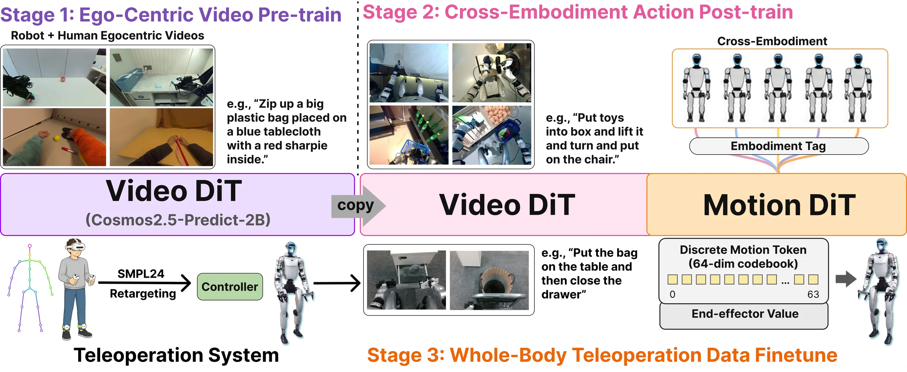

# MotionWAM：面向实时人形 Loco-Manipulation 的世界动作模型

MotionWAM 关注两个问题：一是普通 WAM 需要对高维未来视频反复去噪，难以满足人形机器人的实时闭环控制；二是常见 humanoid loco-manipulation 系统将上半身 manipulation 与下半身 locomotion 分开控制，使腿主要负责移动和平衡，难以直接参与踢球、踩踏板等任务。

MotionWAM 使用 **Video DiT + Motion DiT** 的双 DiT 结构，通过 Video DiT 的一次中间去噪特征直接条件化 Motion DiT，并使用 SONIC 的统一全身 motion latent 表示 locomotion、torso、height、foot interaction 与 hand manipulation。

<div class="paper-overview" markdown>

{ loading=lazy }

<span class="paper-overview__caption">图：MotionWAM 的第一视角视频预训练、跨本体动作 post-training 与 Unitree G1 全身遥操作微调流程。图片来自论文官方版本。</span>

</div>

<!-- more -->

## 论文信息

- **论文：** [MotionWAM: Towards Foundation World Action Models for Real-Time Humanoid Loco-Manipulation](https://arxiv.org/abs/2606.09215)
- **作者：** Jia Zheng, Teli Ma, Yudong Fan, Zifan Wang, Shuo Yang, Junwei Liang
- **机构：** Mondo Robotics, HKUST (GZ), HKUST
- **版本：** arXiv:2606.09215v1, 2026-06-08
- **实验平台：** Unitree G1 + dual ALOHA2 grippers + Intel RealSense D435i
- **任务输入：** 单个头部第一视角 RGB、language goal、robot proprioception
- **任务输出：** unified whole-body motion latent，经 SONIC 转换为机器人关节控制
- **学习范式：** Stage 1 为视频自监督生成学习；Stage 2 / 3 使用带动作标签 demonstration 的 flow-matching imitation learning，不使用 RL reward

> 实机实验使用的是 **双 ALOHA2 平行夹爪，不是灵巧手**。方法中的连续末端执行器通道可以容纳 gripper 或 dexterous-hand commands，但本文真实 G1 实验采用夹爪。

---

## 1. 研究背景与整体思路

### 1.1 传统 humanoid policy 的动作空间割裂

常见 hierarchical system 将控制拆成：

```text
High-Level Manipulation Policy
        ↓
Upper-Body Joint / EEF Target

Low-Level Locomotion Controller
        ↓
Base Velocity / Height / Orientation
```

上半身获得细粒度动作，下半身只获得粗粒度移动命令，因此腿通常只能负责 locomotion 与 balance preservation，难以表达：

```text
抬腿踢球
踩下踏板
主动改变足部接触
下蹲并配合双手操作
```

MotionWAM 将这些行为统一到一个 whole-body motion latent 中，让同一个策略直接决定全身任务级运动。

### 1.2 WAM 的实时性问题

普通 World Action Model 往往需要：

```text
Current Observation
        ↓
Future Video Noise
        ↓
Video World Model
        ↓
多次迭代去噪
        ↓
较完整的 Future Video / Future Latent
        ↓
Action Model
        ↓
Robot Action
```

视频 latent 同时包含时间和空间维度，Transformer 每次处理大量 spatiotemporal tokens；如果还需要多次 Video DiT forward 完成去噪，计算成本很高。

MotionWAM 的关键改动是：

```text
Future Video Noise
        ↓
Video DiT 只 forward 一次
        ↓
Intermediate Hidden Feature
        ↓
Motion DiT
        ↓
Whole-Body Motion
```

因此它并不在部署时生成完整未来视频，而是直接利用视频世界模型内部已经形成的 dynamics-aware representation。

---

## 2. 整体训练框架

```text
Cosmos-Predict2.5-2B Video DiT
        ↓
Stage 1：Egocentric Video Pretraining
约 2,136 h Human + Humanoid + Robot Egocentric Video
        ↓
学习第一视角 visual dynamics prior
        ↓
Stage 1 Checkpoint

        ↓
Stage 2：Cross-Embodiment Action Post-training
Heterogeneous Humanoid Action-Labeled Data
        ↓
Video DiT + Motion DiT Joint Training
        ↓
将 video dynamics grounding 到 robot action space
        ↓
Stage 2 Checkpoint

        ↓
Stage 3：Whole-Body Teleoperation Fine-tuning
Unitree G1 Target-Task Teleoperation
9 tasks × 200 episodes
        ↓
Unified Whole-Body Motion Token Fine-tuning
        ↓
Final Multi-Task MotionWAM
```

三个阶段不是三个独立模型。Stage 1 先专门训练 Video DiT，Stage 2 接入 Motion DiT 并联合训练，Stage 3 在目标 Unitree G1 的真实任务数据上端到端微调。

VAE 与 text encoder 在三个阶段始终冻结。

---

## 3. Stage 1：Egocentric Video Pretraining

### 3.1 Stage 1 流程

```text
约 2,136 h Egocentric Video
Human + Humanoid + Other Robot
        ↓
从视频中取得：
Current Conditioning Clip o_t
+
GT Future Clip o_{t+1}
+
Language Goal l
        ↓
Frozen Video VAE
        ↓
Current Clean Latent z_t^0
+
Future Clean Latent z_{t+1}^0
        │
        │  Sample Random Video Flow Time
        │  Sample Gaussian Noise
        ▼
Interpolate Clean Future Latent
with Gaussian Noise
        │
        ├──────── Current z_t^0
        ├──────── Language l
        └──────── Flow Time τ_v
                 ↓
              Video DiT
                 ↓
Predicted Video Velocity
                 │
Target Video Velocity
                 ↓
Video Flow-Matching Loss
                 ↓
          Backpropagation
                 ↓
Only Update Video DiT
                 ↓
        Stage 1 Checkpoint
```

### 3.2 数据与训练目标

Stage 1 不需要 robot action label。数据混合约为：

```text
Human Egocentric Video          30%
G1-Class Humanoid Video         50%
Other Real-Robot Video          20%
```

其中包含 EgoDex、Humanoid-Everyday、UnifoLM-WBT、RoboCOIN 等来源。即使某些 robot dataset 自带动作标签，Stage 1 也只读取其 video stream。

训练样本由当前视频片段 \(o_t\) 和紧随其后的 future clip \(o_{t+1}\) 构成。论文使用 \(t\) 与 \(t+1\) 表示当前与未来 observation，但没有给出具体 condition-frame 数量和 future-frame 数量。

Stage 1 学习的是：

$$
p_v(o_{t+1}\mid o_t,l)
$$

也就是在当前第一视角观察与语言目标条件下，未来视觉状态应如何变化。这里的目标不是动作，也不是恢复当前画面，而是建模 **future visual dynamics**。

### 3.3 Video Flow-Matching Loss

VAE 先得到真实 future latent \(z_{t+1}^0\)，然后与 Gaussian noise 构造中间状态：

$$
z_{t+1}^{\tau_v}
=
(1-\tau_v)z_{t+1}^0+\tau_v\epsilon_v
$$

由于这条路径是一条直线，它相对于 \(\tau_v\) 的正确速度为：

$$
v^*=\epsilon_v-z_{t+1}^0
$$

Video DiT 预测该 velocity：

$$
v_\theta^{video}
\left(
z_{t+1}^{\tau_v},\tau_v
\mid z_t^0,l
\right)
$$

损失为：

$$
\mathcal L_{video}
=
\mathbb E
\left[
\left\|
v_\theta^{video}
-
(\epsilon_v-z_{t+1}^0)
\right\|_2^2
\right]
$$

真实 future clip 本身提供监督，因此这里属于 **self-supervised future-video modeling**，不需要人工逐帧标注“物体应该向哪里移动”。

### 3.4 参数更新

```text
Frozen
├── Video VAE
└── Text Encoder

Train
└── Video DiT
```

训练配置：

```text
100K steps
128 GPUs
Per-device Batch Size：8
Video DiT LR：1e-5
```

Stage 1 的产物不是机器人 policy，而是一个更适应第一视角交互场景的 Video DiT，使其 hidden states 包含 egocentric visual-dynamics prior。

---

## 4. Stage 2：Cross-Embodiment Action Post-training

### 4.1 Stage 2 流程

```text
Stage 1 Video DiT
        +
Heterogeneous Action-Labeled Humanoid Data
        ↓

一条 Training Sample
│
├── Current Observation o_t
├── GT Future Observation o_{t+1}
├── Language l
├── Proprioception p_t
├── GT Motion-Latent Chunk m_t^0
└── Embodiment Tag e
        │
        ├─────────────────────────────────────┐
        │                                     │
        ▼                                     ▼
   Video Branch                          Motion Branch
        │                                     │
Current/Future RGB                      GT m_t^0
        ↓                                     │
Frozen VAE                               Add Noise
        ↓                                     ↓
Video Latents                         m_t^{τ_a}
        │                                     │
        │      One-Shot Imagination            │
        │      at the Pure-Noise End            │
        │      Future Gaussian Noise           │
        ▼                                     │
     Video DiT                                │
        │                                     │
        ├── Intermediate Hidden h_t^{τ_f} ────┤
        │                                     │
        │                                  p_t + e
        │                                     ↓
        │                              Per-Embodiment
        │                                 Projector
        │                                     ↓
        │                                 Motion DiT
        │                          Self-Attention + Cross-Attention
        │                                     ↓
        │                           Predicted Motion Velocity
        │                                     │
        │                         Target Motion Velocity
        │                                     ↓
        │                          Motion Flow-Matching Loss
        │
        └── Random Video Flow ─────→ Video Flow-Matching Loss

Joint Video / Motion Loss
        ↓
Joint Backpropagation
        ↓
Update Video DiT + Motion DiT + Projectors
        ↓
Stage 2 Checkpoint
```

### 4.2 Stage 2 的核心变化

Stage 1 只知道“世界接下来可能怎样变化”，还不知道这种变化对应什么机器人动作。Stage 2 接入 Motion DiT，将 Video DiT 的动态表示 ground 到 robot action space。

Motion DiT 的条件输入为：

$$
h_t^{\tau_f},\quad p_t,\quad e
$$

其中：

- \(h_t^{\tau_f}\)：Video DiT 在固定 flow time \(\tau_f\approx1\) 的中间 hidden feature；
- \(p_t\)：robot proprioception；
- \(e\)：embodiment index。

动作生成对象为 noisy motion-latent chunk：

$$
m_t^{\tau_a}
=
(1-\tau_a)m_t^0+\tau_a\epsilon_m
$$

Motion DiT 学习：

$$
v_\phi^{motion}
\left(
m_t^{\tau_a},\tau_a
\mid h_t^{\tau_f},p_t,e
\right)
$$

正确 velocity 为：

$$
\epsilon_m-m_t^0
$$

因此：

$$
\mathcal L_{motion}
=
\mathbb E
\left[
\left\|
v_\phi^{motion}
-
(\epsilon_m-m_t^0)
\right\|_2^2
\right]
$$

### 4.3 Intermediate Hidden Feature

MotionWAM 不要求 Video DiT 把 future video 完整去噪。在动作条件分支中，将 future flow time 固定在：

$$
\tau_f\approx1
$$

也就是接近 pure noise 的位置。Video DiT 只进行一次 forward，并通过 forward hook 读取某个 Transformer block 的 activation：

$$
h_t^{\tau_f}=H[\text{Video DiT activation}]
$$

该 hidden feature 维度为 2048，随后作为 Motion DiT 的 cross-attention condition。

这一设计的重点是：

```text
不需要得到清晰 Future RGB
        ↓
只保留 Video DiT 对“未来怎样发展”的内部表示
        ↓
直接用于动作生成
```

Stage 2 中 Video DiT 与 Motion DiT 联合训练，因此 motion loss 也会促使 Video DiT 的中间表示变得更适合 action prediction。

> 论文没有给出代码级实现，且 \(L_{video}\) 使用随机 \(\tau_v\)，动作条件特征使用固定 \(\tau_f\approx1\)。因此两者是否在实现中共享同一次 Video DiT forward，论文没有明确说明。

### 4.4 Cross-Embodiment Projector

Stage 2 的数据存在不同 end-effector 与 action annotation format。为使它们共享同一个 Motion DiT trunk，论文使用：

```text
Embodiment-Specific Input Projector
        ↓
Shared Motion DiT Trunk
        ↓
Embodiment-Specific Output Projector
```

不同 action vector 统一 right-pad 到最大 66 维，同时使用 mask 标记真实有效通道，避免 padding 值参与 loss。

这样可以把：

```text
不同 robot / end-effector action layout
        ↓
映射到共同 Motion-DiT feature space
        ↓
共享视觉—动作知识
```

### 4.5 Loss 与参数更新

Stage 2 保留 video objective：

$$
\boxed{
\mathcal L_{Stage2}
=
\mathcal L_{motion}
+
\mathcal L_{video}
}
$$

其中：

- \(\mathcal L_{motion}\)：建立 video dynamics → robot action 的对应关系；
- \(\mathcal L_{video}\)：作为 representation regularizer，避免 Video DiT 在动作训练中遗忘 Stage 1 的 visual dynamics prior。

```text
Frozen
├── VAE
└── Text Encoder

Train
├── Video DiT
├── Motion DiT
└── Per-Embodiment Projectors
```

训练配置：

```text
50K steps
32 GPUs
Per-device Batch Size：8
Video DiT LR：1e-5
Motion DiT LR：1e-4
```

---

## 5. Stage 3：Whole-Body Teleoperation Fine-tuning

### 5.1 Stage 3 流程

```text
PICO VR Teleoperation
│
├── VR Headset
├── Two Hand Controllers
└── Two Ankle Trackers
        ↓
XRoboToolkit
        ↓
Full SMPL-24 Human Pose
        ↓
SONIC Retargeting / Controller
        ↓
29-DoF Unitree G1 Motion
        ↓
50 Hz LeRobot Episode
│
├── Head RGB
├── Language Goal
├── Robot State
└── Demonstration Command / Motion
        ↓
9 Tasks × 200 Episodes
        ↓

Stage 2 Checkpoint
        +
Target G1 Training Sample
        ↓
────────────────────────────────
Video Branch
Current / Future RGB
        ↓
Frozen VAE
        ↓
Video DiT
        ↓
h_t^{τ_f}
        ↓
────────────────────────────────
Motion Branch
GT Unified Whole-Body Motion Latent
        ↓
Flow-Matching Add Noise
        ↓
Motion DiT
   ↑
h_t^{τ_f} + p_t + G1 Tag
        ↓
Predicted Motion Latent
        ↓
Motion Flow-Matching Loss
        +
Video Flow-Matching Loss
        ↓
End-to-End Fine-tuning
        ↓
Final MotionWAM
```

### 5.2 Teleoperation Data

Stage 3 使用目标 Unitree G1 的真实 whole-body teleoperation data。每个任务采集 200 episodes，共 9 个任务。

遥操作链路为：

```text
Human VR Tracking
        ↓
SMPL-24 Whole-Body Pose
        ↓
SONIC Retargeting
        ↓
G1 Whole-Body Motion
```

数据以 50 Hz 记录，包括视觉、机器人状态、控制命令和 language goal。

九个任务共同覆盖：

- waist control
- height regulation
- squatting locomotion
- task-driven foot interaction
- body-hand coordination

论文使用一个统一 network 在九任务数据上进行 fine-tuning，并用 language prompt 区分任务，而不是每个任务单独训练一个 policy。

### 5.3 Unified Whole-Body Motion Latent

最终 motion latent 写成：

$$
m_t=(m_t^{cont},\tilde{k}_t)
$$

其中两部分职责不同。

#### SONIC Motion Token

SONIC 的 shared whole-body latent 经过 **Finite Scalar Quantization（FSQ）** 离散化，用于概括：

```text
Locomotion
Torso Motion
Height Regulation
Foot Interaction
```

Stage 3 不额外建立 categorical classification head，而是在 motion latent 中放置一个连续 scalar slot \(\tilde{k}_t\)，用 flow matching 一起回归。推理时：

$$
\hat{k}_t=\operatorname{round}(\hat{\tilde{k}}_t)
$$

再将离散 index 交给 SONIC 解码。

#### Continuous End-Effector Channel

$$
m_t^{cont}
$$

保留 SONIC shared motion latent 未覆盖的连续末端执行器通道。

在本文真实 G1 实验中，这部分对应左右 ALOHA2 gripper control；方法形式上也允许替换为 dexterous-hand continuous commands。

因此 Motion DiT 最终并不是只预测 motion token：

$$
\boxed{
\hat m_t=
(\hat m_t^{cont},\hat{\tilde{k}}_t)
}
$$

### 5.4 Loss 与参数更新

Stage 3 沿用：

$$
\boxed{
\mathcal L_{Stage3}
=
\mathcal L_{motion}
+
\mathcal L_{video}
}
$$

没有新增 RL reward 或 task-specific auxiliary loss。

```text
Frozen
├── VAE
└── Text Encoder

Fine-tune
├── Video DiT
├── Motion DiT
└── Target G1 Projector
```

训练配置：

```text
15K steps
8 GPUs
Per-device Batch Size：8
Video DiT LR：1e-5
Motion DiT LR：1e-4
```

---

## 6. 核心模型与算法

### 6.1 Video VAE

Video DiT 不直接在原始 RGB pixel 上进行生成，而是先使用冻结的 VAE：

```text
RGB Video
        ↓
VAE Encoder
        ↓
Compressed Video Latent
        ↓
Video DiT
```

VAE 的作用是把高维像素压缩到较低维 latent space，使后续 diffusion / flow generation 的计算量更低。

Stage 1–3 都冻结 VAE，因此论文训练的重点不是重新学习视觉压缩，而是更新 Video DiT 对 latent dynamics 的建模能力。

部署时 MotionWAM 不需要把 imagined future latent 解码成完整 RGB，所以无需为了动作预测执行完整 future-video reconstruction。

### 6.2 DiT

**DiT（Diffusion Transformer）** 指使用 Transformer 作为 diffusion / flow model 的预测网络。

以 Video DiT 为例：

```text
Noisy Video Latent Tokens
        ↓
Transformer Blocks
        ↓
Velocity Prediction
```

Transformer 中的 self-attention 会计算 token 间的相关性。一般形式为：

$$
\operatorname{Attention}(Q,K,V)
=
\operatorname{softmax}
\left(
\frac{QK^\top}{\sqrt d}
\right)V
$$

其作用是让不同时间、不同空间位置的视频 token 相互读取信息，例如建立“手部区域—物体区域—未来帧位置变化”之间的关系。

Motion DiT 使用 DiT-B，并通过 **interleaved self-attention / cross-attention** 同时处理：

- noisy motion tokens 之间的时序与全身协调关系；
- motion tokens 与 Video DiT hidden feature 的视觉动态关系。

按标准 cross-attention 的理解，动作 token 会查询 video feature 中与当前动作生成最相关的信息；论文没有进一步展开其具体 Q/K/V 实现。

### 6.3 Flow Matching

Flow Matching 将真实数据 \(x^0\) 与 Gaussian noise \(\epsilon\) 连成连续路径：

$$
x^\tau=(1-\tau)x^0+\tau\epsilon
$$

训练时模型看到中间状态 \(x^\tau\)，学习正确 velocity：

$$
v^*=\epsilon-x^0
$$

```text
Training
GT Data + Gaussian Noise
        ↓
Construct Intermediate State
        ↓
Network Predicts Velocity
        ↓
MSE to GT Velocity
```

推理时从 \(\tau=1\) 的 noise 端向 \(\tau=0\) 反向积分：

```text
Random Noise
        ↓
Repeated Velocity-Field Integration
        ↓
Generated Data
```

MotionWAM 中：

```text
Video DiT  → Video Flow
Motion DiT → Motion Flow
```

区别在于部署时 Video DiT 不完成完整积分，只在 \(\tau_f\approx1\) 处 forward 一次并提取 hidden feature；Motion DiT 则使用 4 个 inference timesteps 生成 motion latent。

### 6.4 Intermediate Denoising Feature

普通 WAM 往往为得到 future video，需要：

```text
Video DiT × 多次
        ↓
Fully Denoised Future Video
```

MotionWAM 改为：

```text
Video DiT × 1
        ↓
Intermediate Hidden Feature
```

这意味着策略不为纹理、像素细节和完整未来视频支付多次去噪成本，只保留对动作有用的动态表示。

该设计是 MotionWAM 实现 real-time WAM inference 的核心。

### 6.5 FSQ 与 SONIC Motion Token

FSQ（Finite Scalar Quantization）的一般思想是将连续 latent 中的标量压到有限离散 level，使连续运动表示变成紧凑 token。

MotionWAM 基于 SONIC 的 shared whole-body latent，使一个 motion representation 能同时承载 locomotion、torso、height 与 foot interaction，而不是分别输出：

```text
Upper Body Joint Target
+
Lower Body Base Velocity
```

最终由 SONIC 将 motion token 解码为真实机器人可跟踪的 joint commands。MotionWAM 负责 task-level whole-body motion generation，SONIC 负责低层 whole-body motion decoding / tracking。

---

## 7. 推理流程

训练完成后，VR teleoperation、SMPL retargeting 和 GT future video 都不参与部署。

```text
Current Robot Observation
│
├── Head RGB o_t
├── Language Goal l
└── Proprioception p_t
        ↓

────────────────────────────────
Video Dynamics Branch
────────────────────────────────

Current RGB
        ↓
Frozen VAE
        ↓
Current Clean Video Latent z_t^0

Random Future Gaussian Noise
        +
Pure-Noise Flow Timestep
        +
Current z_t^0
        +
Language Embedding
        ↓
Video DiT
只进行 1 次 Forward
        ↓
Intermediate Hidden Feature h_t^{τ_f}

────────────────────────────────
Motion Generation Branch
────────────────────────────────

Random Motion Noise
        +
h_t^{τ_f}
        +
Current Proprioception p_t
        +
Unitree G1 Embodiment Tag
        ↓
Motion DiT
        ↓
4 Flow-Matching Inference Steps
        ↓
Whole-Body Motion Latent
Continuous EEF + Motion Token
        ↓
┌─────────────────────────────┐
│                             │
▼                             ▼
Continuous Gripper Value   Quantize Motion Token
                              ↓
                        Discrete SONIC Token
                              ↓
                            SONIC
                              ↓
                    Whole-Body Joint Command
│                             │
└──────────────┬──────────────┘
               ↓
         Real G1 Execution
               ↓
      New RGB + New Proprioception
               ↓
        Next Policy Inference
```

整个系统是 **chunk-wise closed-loop control**。论文在 NVIDIA A100 上测得 MotionWAM 的 action-chunk 输出频率为 4.9 Hz。

这里需要区分两个生成过程：

```text
Video DiT：
不完整生成 future video
只 forward 1 次取 hidden feature

Motion DiT：
真正从 motion noise 生成动作
使用 4 个 inference timesteps
```

因此 MotionWAM 的实时化主要来自删除高维 future-video latent 的多步 iterative denoising，而不是完全取消生成式动作推理。

论文没有明确给出 action chunk 的具体长度和每轮实际执行多少 action steps，因此不能进一步推算单个 chunk 的时间范围。

---

## 8. 实验与消融

### 8.1 与 VLA / Visuomotor Baseline 对比

九个真实 Unitree G1 任务中，MotionWAM 平均成功率为：

```text
MotionWAM       76.1%
GR00T-N1.7      43.9%
```

相对最强 baseline 提升超过 32 个百分点。

Qwen3DiT 保留与 MotionWAM 相同的 Motion DiT 和统一动作空间，只把 Video DiT 换成 Qwen3-VL 静态视觉语言 backbone。其在 locomotion-heavy task 上表现明显下降，说明提升不只是来自 action head，而与 video world-model dynamics prior 有关。

### 8.2 三阶段消融

五个代表任务平均成功率：

| Variant | Stage 1 | Stage 2 | Avg. Success |
|---|---:|---:|---:|
| w/o Stage 2 | ✓ | ✗ | 42.0% |
| w/o Stage 1 | ✗ | ✓ | 59.0% |
| Full | ✓ | ✓ | 70.0% |

对应作用可以概括为：

```text
Stage 1
→ 提供 Egocentric Visual-Dynamics Prior

Stage 2
→ 将 Visual Dynamics Ground 到 Robot Action Space

Stage 3
→ 适配最终 G1 Hardware + Target Tasks
```

Stage 2 的影响更大：没有 cross-embodiment action grounding 时，仅靠目标任务的小规模数据很难训练 Motion DiT。

### 8.3 实时性

A100 上的 chunk-wise policy frequency：

| Model | Frequency |
|---|---:|
| GR00T-N1.7 | 6.5 Hz |
| Qwen3DiT | 9.0 Hz |
| Cosmos Policy | 0.7 Hz |
| MotionWAM | 4.9 Hz |

MotionWAM 比同为 world-model-based policy 的 Cosmos Policy 快约 7 倍，主要原因是 Cosmos Policy 需要迭代去噪 future video，而 MotionWAM 只进行一次 Video DiT forward。

---

## 9. 结论

MotionWAM 的核心并不是提出新的 diffusion 或 Transformer 基础算法，而是将已有 video world-model prior 改造成能够实时驱动 humanoid whole-body control 的策略系统。

主要贡献可以归纳为：

```text
1. Video Dynamics Prior
大规模第一视角视频预训练
        ↓
得到适合 humanoid ego-view 的 dynamics representation

2. Real-Time WAM
不完整生成 future video
        ↓
一次 Video DiT forward 提取 intermediate hidden feature
        ↓
显著降低 WAM 推理成本

3. Unified Whole-Body Action Space
SONIC Motion Token + Continuous EEF Channel
        ↓
同一个 policy 联合决定 locomotion、torso、height、
foot interaction 与 hand manipulation

4. Three-Stage Training
Video Pretraining
→ Cross-Embodiment Action Grounding
→ Target G1 Fine-tuning
```

统一动作空间使腿不再只是维持平衡，而能够直接参与任务，因此 MotionWAM 可以完成 ball kicking 等传统 upper/lower decoupled policy 难以表达的行为。

从系统角度看，这篇工作的关键价值是证明 **video-pretrained WAM 可以从固定底座 tabletop manipulation 扩展到真实、动态平衡、实时闭环的 humanoid loco-manipulation**。

---

## 10. 局限性

论文明确指出三点主要限制：

- Stage 3 只在 Unitree G1 上验证，尚未证明完整三阶段 recipe 能直接迁移到其他 humanoid hardware。
- 没有进行严格的 novel-object OOD generalization study，训练和测试物体仍具有视觉相似性。
- 只使用单个头部 egocentric camera；当目标物体离开视野或相机 viewpoint 偏离训练分布时，visual grounding 容易丢失，策略会停滞或产生错误 whole-body trajectory。

---

## 11. 最终总流程

```text
══════════════════════════════════════════════
        Stage 1 — Egocentric Video Pretrain
══════════════════════════════════════════════

2,136 h Human + Humanoid + Robot Ego Video
        ↓
Current Clip + GT Future Clip + Language
        ↓
Frozen VAE
        ↓
Future Latent Flow Matching
        ↓
Video DiT
        ↓
Video Flow-Matching Loss
        ↓
Only Train Video DiT
        ↓
Egocentric Visual-Dynamics Prior

══════════════════════════════════════════════
   Stage 2 — Cross-Embodiment Action Post-train
══════════════════════════════════════════════

Action-Labeled Humanoid Data
        ↓
Current / Future RGB + Language
+ Proprioception + GT Motion + Embodiment Tag
        ↓
Video DiT
        ↓
Intermediate Denoising Feature h_t
        ↓
Motion DiT
        ↓
Motion Flow Matching
        ↓
Joint Video / Motion Loss
        ↓
Jointly Train Video DiT + Motion DiT
        ↓
Video-to-Action Grounding

══════════════════════════════════════════════
   Stage 3 — Whole-Body G1 Fine-tuning
══════════════════════════════════════════════

PICO VR
        ↓
SMPL-24
        ↓
SONIC Retargeting
        ↓
G1 Whole-Body Demonstrations
9 Tasks × 200 Episodes
        ↓
Video DiT + Motion DiT
        ↓
Unified Motion Latent
Continuous EEF + SONIC Token
        ↓
Joint Video / Motion Loss
        ↓
End-to-End Fine-tuning
        ↓
Final Multi-Task MotionWAM

══════════════════════════════════════════════
                 Inference
══════════════════════════════════════════════

Head RGB + Language + Proprioception
        ↓
Frozen VAE
        ↓
Current Video Latent
        │
Random Future Noise
        ↓
Video DiT × 1 Forward
        ↓
Intermediate Hidden Feature
        │
Random Motion Noise + Robot State
        ↓
Motion DiT × 4 Flow Steps
        ↓
Continuous Gripper Value
+
Discrete SONIC Motion Token
        ↓
SONIC
        ↓
Whole-Body G1 Execution
        ↓
New Observation
        ↓
Closed-Loop Replanning
```
