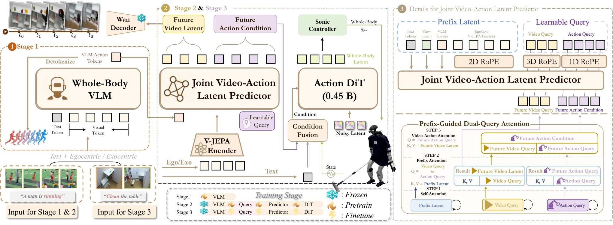

# ω-0：面向人形机器人并发 Loco-Manipulation 的 Latent Predictive World Action Model

ω-0 面向 **concurrent humanoid loco-manipulation**：机器人在操作物体的同时持续进行迈步、躯干调整、平衡控制和手臂运动，而不是先完成 locomotion，再切换到 manipulation。

论文的主要方法是将 **future visual latent prediction** 与 **whole-body action latent generation** 放在同一个模型中联合训练。未来视觉分支只预测紧凑的 latent representation，不在实时控制中生成完整 RGB 视频；动作分支则直接生成 SONIC-compatible whole-body action latent，由低层 SONIC controller 完成真实机器人执行。

<div class="paper-overview" markdown>

{ loading=lazy }

<span class="paper-overview__caption">图：ω-0 的三阶段训练架构。模型用 future visual latent 提供预测监督，并直接生成 SONIC-compatible whole-body action latent。图片来自论文官方版本。</span>

</div>

<!-- more -->

## 论文信息

- **论文：** [ω-0: A Latent Predictive World Action Model for Concurrent Humanoid Loco-Manipulation](https://arxiv.org/abs/2608.06375)
- **作者：** Zhe Li, Zhenzhe Zhang, Yangyang Wei, Wenjie Zhang, Xichen Yuan, Peiyuan Zhi, Gen Li, Xinying Guo, Fengjie Gao, Jianfei Yang, Shanghang Zhang
- **版本：** arXiv:2608.06375v2, 2026-08-09
- **项目主页：** [OMEGA-ZERO](https://gentlefress.github.io/OMEGA-0_page/)
- **主要平台：** Unitree G1 + Inspire DexHands
- **低层控制器：** SONIC
- **Action DiT：** Figure 2 标注约 0.45B parameters
- **训练资源：** 三个 Stage 均使用 8 × NVIDIA H100
- **真实数据集：** ω-HOME，40.3 h、4,827 episodes、24 tasks

---

## 1. 研究背景与整体框架

现有 humanoid VLA 往往直接学习 observation-to-action，或者在系统层面将 locomotion、balance 和 manipulation 分开处理。这样的分解在“走到目标位置后站定操作”的任务中比较有效，但对于擦桌、拖地、从低处取物等任务，机器人需要在移动过程中持续调整全身姿态，显式拆分容易限制动作协调。

另一类 World Action Model 会利用 future visual dynamics 辅助 action generation，但如果把完整未来视频作为动作生成的主要中间表示，不仅计算量较大，视频预测中的时序误差也可能进一步影响 whole-body control。ω-0 因此采用更轻量的设计：只预测 **future visual latent**，将其作为动作学习的辅助 predictive signal，而 Action DiT 直接生成 robot action latent。

三个训练阶段依次完成 action semantics、human-to-humanoid grounding 和 real-world adaptation：

```text
Stage 1：Whole-Body Action VLM Pretraining
Public Human Video + Language + Human Motion
        ↓
FAST 构造离散 Action Tokens
        ↓
Qwen3-VL 学习 Whole-Body Action Semantics
        ↓
Action-Aware VLM Feature f_vlm

Stage 2：Human-to-Humanoid Action-Latent Pretraining
Human Motion
        ↓
SONIC Simulation Replay
        ↓
Robot State + Robot Action Latent
        │
        ├── Future Visual Latent Prediction
        └── Diffusion Action Generation
        ↓
Stage-2 World-Action Model

Stage 3：Real-World Fine-tuning
真实 Humanoid Loco-Manipulation Trajectory
        ↓
继续训练 Joint Predictor + Action DiT
        ↓
加入 RTC 保证 Action Chunk 连续性
        ↓
Final ω-0
```

三个 Stage 并不是三个独立 policy。Stage 1 得到的 Whole-Body Action VLM 在 Stage 2 和 Stage 3 中被冻结并作为 action-semantic prior；Stage 2 训练得到的 Joint Video-Action Latent Predictor 与 Action DiT 再在 Stage 3 中使用真实机器人数据继续 fine-tune。

---

## 2. Stage 1：Whole-Body Action VLM Pretraining

### 2.1 Stage 1 流程

```text
Public Human Video + Language + Human Motion
        ↓
SMPL-H / SMPL-X
        ↓
统一成 SMPL Motion
        ↓
────────────────────────────────
Whole-Body FAST
────────────────────────────────

Future Motion Chunk
a_{t:t+H}
        ↓
FAST Encode
        ↓
Discrete Action Tokens
c_{1:N}
        ↓
FAST Detokenize
        ↓
Reconstructed Motion â_{t:t+H}
        ↓
Tokenizer Reconstruction Objective
（公式见 2.2 节）

FAST 训练完成后：
Real Future Motion
        ↓
FAST
        ↓
GT Action Tokens
        │
        ▼
────────────────────────────────
Whole-Body Action VLM
────────────────────────────────

Current Visual Observation o_t^v
+
Language Instruction l
+
View Token e^v
        ↓
Qwen3-VL-2B-Instruct
        ↓
Autoregressive Action-Token Prediction
        ↕
GT FAST Tokens c_{1:N}
        ↓
L_vlm
        ↓
Whole-Body Action VLM
        ↓
Action-Aware Hidden Feature f_vlm
```

### 2.2 数据与 FAST Action Token

公开数据中的 SMPL-H / SMPL-X motion 先统一到 SMPL representation，并进一步统一坐标系。Stage 1 从一条同步 video-motion trajectory 中构造当前视觉条件和 future whole-body motion chunk：

$$
a_{t:t+H}\in\mathbb{R}^{H\times d_a}
$$

Whole-Body FAST 将整段连续动作编码为离散 token sequence：

$$
c_{1:N}=E_{\mathrm{act}}(a_{t:t+H})
$$

对应的 detokenizer 重建动作：

$$
\hat a_{t:t+H}=D_{\mathrm{act}}(c_{1:N})
$$

论文给出的 tokenizer reconstruction objective 为：

$$
L_{\mathrm{tok}}
=
\left\|
\hat a_{t:t+H}-a_{t:t+H}
\right\|_1
$$

FAST token 与物理时间步并不是一一对应关系。整个 \(H\)-step motion chunk 被编码成 \(N\) 个 discrete tokens，因此不能写成 \(a_t\leftrightarrow c_1\)、\(a_{t+1}\leftrightarrow c_2\)。

FAST 训练完成后，真实 future motion 经过 FAST 得到的 token sequence 作为 Qwen3-VL 的 ground-truth action labels。

### 2.3 Whole-Body Action VLM

作者将 Qwen3-VL-2B-Instruct fine-tune 为 Whole-Body Action VLM。输入写为：

$$
x=[e^v,o_t^v,\ell]
$$

其中 \(e^v\) 是区分 egocentric / exocentric observation 的 learnable view token。

模型按照 autoregressive next-token prediction 方式预测 action tokens：

$$
p_\theta(c_{1:N}|e^v,o_t^v,\ell)
=
\prod_{i=1}^{N}
p_\theta(c_i|c_{<i},e^v,o_t^v,\ell)
$$

对应：

$$
L_{\mathrm{vlm}}
=
-\sum_{i=1}^{N}
\log p_\theta(c_i|c_{<i},\ell,o_t^v,e^v)
$$

这里的 GT 是离散 token ID，loss 比较的是模型赋给正确 token 的 probability，而不是 token ID 数值之间的距离。

Stage 1 训练完成后，后续阶段并不直接使用 FAST token 控制机器人，而是取 VLM 内部的：

$$
f_{\mathrm{vlm}}
$$

作为 **action-aware semantic prior**。它编码当前视觉与语言条件下对应的 whole-body action semantics。

!!! note "Stage-1 Visual Input"

    论文 Method 将输入写成当前 visual observation \(o_t^v\)，数据部分则使用 language-conditioned videos 描述原始数据。可以确定原始数据是同步 video-motion trajectory，但正文没有进一步说明 Stage-1 视觉端究竟严格采样单帧还是短 video clip。

---

## 3. Stage 2：Human-to-Humanoid Action-Latent Pretraining

### 3.1 Stage 2 流程

```text
════════════════════════════════════
监督数据构造
════════════════════════════════════

Public Human SMPL Motion
        ↓
SONIC Simulation Replay
        ↓
Robot State s_t
+
GT Robot Action Latent z_0

Real Future Video
        ↓
Frozen Wan Encoder
        ↓
GT Future Visual Latent y^v


════════════════════════════════════
当前条件编码
════════════════════════════════════

Current Image o_t^v
   ├──→ Frozen V-JEPA ─────→ f_t^v
   │
   └──→ Frozen Stage-1 VLM → f_vlm
                  ↑
               Language

Language ─→ T5 ────────────→ f_l
View ───────────────────────→ r^v

        ↓
Prefix Condition


════════════════════════════════════
Joint Video-Action Latent Predictor
════════════════════════════════════

Motion Queries q^m
+
Video Queries q^v
+
Prefix p
        ↓
Step 1：Separate Self-Attention
        ↓
Step 2：Query → Prefix Cross-Attention
        ↓
Step 3：Motion → Video Cross-Attention
        ↓
┌────────────────┬─────────────────┐
│                │                 │
h^v              h^m
Future Visual    Future-Aware
Feature          Motion Feature
│                │
│                └─────────────┐
│                              │
▼                              ▼
L_video      h^m + Text + Robot State Feature
                               ↓
                        Condition Fusion
                               ↓
                             c_dit


════════════════════════════════════
Action Diffusion
════════════════════════════════════

GT Action Latent z_0
        ↓
Add Gaussian Noise
        ↓
z_τ
        │
        │ + timestep τ + c_dit
        ▼
Action DiT
        ↓
Predicted Clean Latent z_hat_0
        ↕
GT z_0
        ↓
L_action

Stage-2 Joint Objective
（公式见 3.6 节）
```

### 3.2 SONIC Simulation Replay 与 Robot Action Latent

公开 human data 中没有 robot proprioception，也没有 SONIC-compatible controller action。作者因此把 human SMPL trajectory 放进 simulation，由 SONIC 跟踪 reference motion，并记录对应的 robot state 与 whole-body action latent。无法可靠跟踪的 highly dynamic 或 physically infeasible trajectory 会被过滤。

这一步不是简单的 human-to-robot 数学映射，而是通过已有 low-level controller 与物理仿真把 human motion 转换成 **robot-executable supervision**。

Robot state 定义为：

$$
s_t=
[q_{\mathrm{pos}},q_{\mathrm{hand}},r_{\mathrm{torso}}^{6D}]
$$

其中包括 body joint positions、dexterous hand joint positions 和 torso/root orientation，最终为 47D。orientation 使用连续 6D rotation representation，避免 quaternion 中 \(q\) 与 \(-q\) 表示同一旋转带来的数值 discontinuity。

论文 Appendix 给出的每个 action step 为 66D：

$$
66D
=
64D\ \text{whole-body action latent}
+
2D\ \text{hand commands}
$$

两个 hand commands 分别控制左右手 grasp，取值范围为 \([0,1]\)。因此 Inspire DexHands 是实际硬件，但 ω-0 的 policy action interface 并不是逐关节输出完整 dexterous-hand joint target。

### 3.3 Prefix Condition

当前 observation 经过多条 frozen / pretrained feature branch：

- **V-JEPA 2.1：** \(o_t^v\rightarrow f_t^v\)，提供当前视觉 representation；
- **Stage-1 Whole-Body Action VLM：** visual + language \(\rightarrow f_{\mathrm{vlm}}\)，提供 action-semantic prior；
- **T5：** language \(\rightarrow f_\ell\)，提供独立 text feature；
- **View Token：** \(r^v\)，区分 ego / exo perspective。

随后组成：

$$
p=[f_{\mathrm{vlm}},f_\ell,r^v,f_t^v]
$$

Robot state 没有直接拼入 prefix，而是在后面的 State Encoder 与 Condition Fusion 中加入 Action DiT condition。

### 3.4 Motion Query、Video Query 与三层 Attention

模型引入两组 learnable queries：

```text
Motion Queries q^m
→ 数量与 Action Chunk 长度一致
→ 每个 Query 对应一个 future action step

Video Queries q^v
→ 对应 Future Visual Latent Tokens
→ 表示未来视频中的时空 latent slot
```

三个 Attention Step 为：

#### Step 1：Separate Self-Attention

Prefix、Motion Query、Video Query 分别独立做 self-attention：

$$
p\rightarrow\tilde p,\qquad
q^m\rightarrow\tilde q^m,\qquad
q^v\rightarrow\tilde q^v
$$

这一步负责建立各自内部的信息依赖，没有单独 intermediate loss。Query 与 attention parameters 通过后面的 \(L_{\mathrm{video}}\) 和 \(L_{\mathrm{action}}\) 端到端更新。

#### Step 2：Prefix Cross-Attention

Motion Query 与 Video Query 分别读取当前 Prefix：

$$
\bar q^m=
\mathrm{CrossAttn}_m(\tilde q^m,\tilde p)
$$

$$
\bar q^v=
\mathrm{CrossAttn}_v(\tilde q^v,\tilde p)
$$

对应的 Q/K/V 关系为：

$$
Q_{\mathrm{motion}}=\widetilde q^m,
\qquad K_{\mathrm{motion}},V_{\mathrm{motion}}=\widetilde p
$$

$$
Q_{\mathrm{video}}=\widetilde q^v,
\qquad K_{\mathrm{video}},V_{\mathrm{video}}=\widetilde p
$$

这一步把 current visual / language / action-semantic information 写入两个 future representation。

#### Step 3：Motion-to-Video Cross-Attention

最后让 Motion Query 读取 Video Query：

$$
h^m=
\mathrm{CrossAttn}_{mv}(\bar q^m,\bar q^v)
$$

$$
h^v=\bar q^v
$$

对应：

$$
Q=\bar q^m,
\qquad K,V=\bar q^v
$$

因此 \(h^m\) 不只包含 current condition，还吸收了预测的 future visual dynamics，论文将其作为 future-aware motion feature。

位置编码根据 token 结构分别使用：

```text
Visual Prefix Token → 2D RoPE
Future Video Query  → 3D RoPE
Motion Query        → 1D Temporal RoPE
```

### 3.5 Future Visual Latent Loss

真实 future video：

$$
o^v_{t+1:t+K}
$$

经过 frozen Wan Encoder：

$$
y^v_{t+1:t+K}
=
E_{\mathrm{Wan}}(o^v_{t+1:t+K})
$$

Joint Predictor 输出的 \(h^v\) 与其做 MSE：

$$
L_{\mathrm{video}}
=
\left\|
h^v-y^v_{t+1:t+K}
\right\|_2^2
$$

Wan Decoder 只在需要 qualitative visualization 时把 predicted latent 解码成 RGB video，不参与实时 policy control。部署时也不存在真实 future video GT。

### 3.6 Condition Fusion 与 Action DiT

Robot state 经 State Encoder 得到：

$$
f_s=E_s(s_t)
$$

随后将：

$$
h^m,\quad f_\ell,\quad f_s
$$

投影到 shared hidden dimension，并由 Condition Fusion 得到：

$$
c_{\mathrm{dit}}
=
\Phi_{\mathrm{cond}}([h^m,f_\ell,f_s])
$$

论文没有进一步说明 \(\Phi_{\mathrm{cond}}\) 内部具体采用 MLP、Attention 还是其他结构。

GT whole-body action latent chunk 记为 \(z_0\)。训练时在 diffusion timestep \(\tau\) 加 Gaussian noise：

$$
z_\tau
=
\sqrt{\bar\alpha_\tau}z_0
+
\sqrt{1-\bar\alpha_\tau}\epsilon,
\qquad
\epsilon\sim\mathcal N(0,I)
$$

Action DiT 输入 \(z_\tau\)、\(\tau\) 和 \(c_{\mathrm{dit}}\)，直接预测 clean latent：

$$
\hat z_0
=
D_\theta(z_\tau,\tau|c_{\mathrm{dit}})
$$

ω-0 使用 \(x_0\)-prediction objective：

$$
L_{\mathrm{action}}
=
\|\hat z_0-z_0\|_2^2
$$

最终：

$$
\boxed{
L_{\mathrm{stage2}}
=
L_{\mathrm{action}}
+
\lambda_{\mathrm{video}}L_{\mathrm{video}}
}
$$

### 3.7 Stage 2 参数更新

Stage 2 中：

```text
Frozen
├── V-JEPA Encoder
├── Wan Encoder
└── Stage-1 Whole-Body Action VLM

Train
├── Joint Video-Action Latent Predictor
├── State Encoder
├── Condition Fusion
└── Action DiT
```

论文将 T5 描述为 pretrained T5 encoder，但没有在冻结列表中单独明确说明其参数更新状态。

---

## 4. Stage 3：Real-World Fine-tuning

### 4.1 Stage 3 流程

```text
Real Humanoid Demonstration
│
├── Language
├── Ego / Exo Observation
├── Robot State
├── Real Action Latent
└── Real Future Video
        ↓
基本复用 Stage-2 Architecture
        ↓
────────────────────────────────
Future Visual Branch
────────────────────────────────

Current Condition
        ↓
Joint Predictor
        ↓
h^v
        ↕
Real Future Video
        ↓
Frozen Wan Encoder
        ↓
GT Future Visual Latent
        ↓
L_video


────────────────────────────────
RTC Action Branch
────────────────────────────────

Real GT Action Chunk z_0
        ↓
Add Noise → z_τ
        ↓
Random Prefix Length M
        ↓

1 ... M        M+1 ... H
Clean GT   |   Noisy Future
           |
           ↓
        Action DiT
           ↓
Predicted Clean Future
           ↓
只对 M+1:H 计算
L_RTC

Stage-3 Joint Objective
（公式见 4.3 节）
        ↓
Final Multi-Task ω-0
```

### 4.2 真实机器人数据

ω-HOME 包含 40.3 小时、4,827 episodes 和 24 个 household tasks，记录 language、egocentric RGB、exocentric RGB-D、whole-body SMPL motion、robot state 和 action latent。

Stage 3 的 downstream training 选择 11 个 household loco-manipulation tasks，每个任务约 200 demonstrations，共 2,220 trajectories，并将所有任务混合起来 fine-tune **一个 general multi-task ω-0**，而不是一个任务训练一个 policy。

### 4.3 RTC Training

Stage 3 的网络主体沿用 Stage 2，主要新增 **RTC（Real-Time Chunking）** 训练方式，用于减少相邻 diffusion action chunks 的边界 discontinuity。

对真实 GT action latent chunk：

$$
z_0^{1:H}
$$

先按照普通 diffusion 得到 \(z_\tau^{1:H}\)，再随机采样 prefix length \(M\)，把前 \(M\) 个 noisy latent 替换成 clean GT：

$$
\tilde z_\tau^{1:M}
=
z_0^{1:M}
$$

后半段保持 noisy：

$$
\tilde z_\tau^{M+1:H}
=
z_\tau^{M+1:H}
$$

由于 prefix 已经直接给出 GT，只对后半段计算 loss：

$$
L_{\mathrm{RTC}}
=
\left\|
\hat z_0^{M+1:H}
-
z_0^{M+1:H}
\right\|_2^2
$$

Stage 3 总目标为：

$$
\boxed{
L_{\mathrm{stage3}}
=
L_{\mathrm{RTC}}
+
\lambda_{\mathrm{video}}L_{\mathrm{video}}
}
$$

### 4.4 Stage 3 参数更新

继续冻结：

```text
V-JEPA
Wan Encoder
Stage-1 Whole-Body Action VLM
```

继续 fine-tune：

```text
Joint Video-Action Latent Predictor
State Encoder
Condition Fusion
Action DiT
```

Stage 3 的作用主要是把 Stage 2 从 public-human / simulation-grounded representation 进一步适配到真实机器人 sensing、contact 和 household interaction。

---

## 5. 核心模型与算法

### 5.1 Vision-Language-Action 与 World Action Model

从接口上看，ω-0 属于 vision-language-conditioned robot policy：

```text
Vision
+
Language
+
Robot State
        ↓
Action
```

因此具有典型 VLA 的输入输出结构。但与普通 observation-to-action VLA 相比，ω-0 在 action generation 前额外学习 future visual latent，使模型的动作 representation 同时受到当前 observation 和预期 scene evolution 的约束。

Stage 1 本身是 **VLM**，负责学习 action-aware visual-language semantics；Stage 2 / 3 才形成完整的 visual-language-state-to-action pipeline。

### 5.2 FAST

FAST 的作用是把连续 high-dimensional action trajectory 转成适合语言模型预测的 discrete token sequence。

标准 FAST 的基本思想是利用动作序列在时间上的平滑性，将 trajectory 转到频率表示后进行量化和 tokenization，使长段连续动作可以表示成较紧凑的离散 token sequence。

ω-0 正文将 FAST 抽象为：

$$
a_{t:t+H}
\xrightarrow{E_{\mathrm{act}}}
c_{1:N}
\xrightarrow{D_{\mathrm{act}}}
\hat a_{t:t+H}
$$

并给出 \(L_{\mathrm{tok}}\) reconstruction objective，但没有进一步展开 FAST 内部实现。因此不应把这里的 \(E_{\mathrm{act}}\) / \(D_{\mathrm{act}}\) 直接理解成普通 neural autoencoder。

### 5.3 V-JEPA 与 Latent Future Prediction

JEPA（Joint-Embedding Predictive Architecture）的核心思想是：

```text
不要求模型重建所有 pixel
而是在 representation space 中预测未来 / 缺失内容
```

相比 pixel reconstruction，latent prediction 更关注语义和动态结构，也避免生成完整高分辨率视频的计算开销。

ω-0 借鉴的是这种 **reconstruction-free future embedding prediction** 思路。需要区分具体实现：

```text
Current Image
→ Frozen V-JEPA 2.1
→ Current Visual Feature

Real Future Video
→ Frozen Wan Encoder
→ Future Visual GT
```

也就是说，ω-0 并没有直接照搬标准 V-JEPA 的完整训练结构，而是将 V-JEPA 用作 current-image encoder，并使用 Wan latent 作为 future visual supervision。

### 5.4 三层 Attention

三个 Attention Step 分别承担不同的信息交互：

```text
Step 1：Self-Attention
同类 token 内部建立依赖关系

Step 2：Prefix Cross-Attention
Future Motion / Video Query 读取当前视觉、语言和动作语义

Step 3：Motion-to-Video Cross-Attention
Future Motion Query 读取 predicted future visual representation
```

Cross-Attention 中可以用统一规则理解 Q/K/V：需要获取信息的一方作为 Query，提供信息的一方作为 Key / Value。因此 Step 3 中：

$$
Q=\text{Motion Query},
\qquad K,V=\text{Video Query}
$$

使 \(h^m\) 具有 future-aware information。

### 5.5 Diffusion Transformer

Diffusion 的训练从 clean data \(z_0\) 出发，对其加入不同强度的 Gaussian noise 得到 \(z_\tau\)，模型学习根据 condition 恢复 clean data。

DiT（Diffusion Transformer）使用 Transformer 作为 diffusion denoiser。ω-0 的 Action DiT 不预测 noise，而直接采用：

```text
x0-prediction
```

即：

$$
(z_\tau,\tau,c_{\mathrm{dit}})
\rightarrow
\hat z_0
$$

并通过：

$$
L_{\mathrm{action}}
=
\|\hat z_0-z_0\|_2^2
$$

训练。

### 5.6 SONIC 与 Action Latent

ω-0 不直接输出每个电机 torque，也不直接承担底层 balance control。

整体控制层级为：

```text
High-Level ω-0
Image + Language + State
        ↓
Controller-Compatible Action Latent
        ↓
Low-Level SONIC
        ↓
Executable Whole-Body Control
        ↓
Unitree G1
```

因此 SONIC 同时承担两个角色：

```text
训练阶段：
Simulation Replay
→ 从 Human Motion 提取 Robot-Executable Supervision

部署阶段：
Low-Level Controller
→ 执行 ω-0 生成的 Whole-Body Action Latent
```

---

## 6. 推理与真机闭环

训练完成后，推理阶段不再需要 human SMPL GT、FAST token GT、SONIC replay 或真实 future video。实时输入只有当前 observation、language 和 robot state。

```text
Current Egocentric Image
+
Language Instruction
+
Current Robot State
        ↓

V-JEPA / Stage-1 VLM / T5
        ↓
Prefix Condition
        │
        │ + Motion / Video Queries
        ▼
Joint Video-Action Latent Predictor
        ↓
h^m
        │
        │ + Text Feature + State Feature
        ▼
Condition Fusion
        ↓
c_dit
        │
        │
Initial Noisy Action Latent
        ↓
DDIM Reverse Denoising
        ↓
Action DiT
        ↓
25-Step Future Action Chunk
        ↓
Execute First 8 Actions
        ↓
Acquire New Image + New Robot State
        ↓
Next Policy Update
```

Appendix B 给出的部署设置为：

- Action chunk 长度：\(H=25\)；
- 每轮执行动作数：\(K=8\)；
- 单次 forward：约 \(0.14\,\mathrm{s}\)；
- Policy inference：高于 \(7\,\mathrm{Hz}\)。

因此采用的是 **receding-horizon control**：每次预测较长的 future action chunk，但只执行前 8 步，然后立即根据最新视觉与 proprioception 重新规划。

### 6.1 RTC Warm Start

第一轮可以从 Gaussian noise 初始化完整 action chunk。后续推理时，上一轮预测中尚未执行的一小段 future action 会被保存：

```text
Previous Prediction
[a1 ... a8 | a9 a10 ... a25]
 ↑ executed   ↑ unexecuted future
```

下一轮 diffusion initialization 不再全部重新采样，而是把这段 unexecuted future 插入新 action chunk 的 prefix：

```text
Previous Future Prefix
+
New Noisy Future
        ↓
Action DiT
        ↓
Updated Action Chunk
```

这样既保留上一轮计划的 temporal continuity，又允许最新 observation 和 robot state 修正后续动作。

### 6.2 Overlap Blending

相邻 chunk 的 overlap region 还会做 linear blending：

$$
a_j^{\mathrm{blend}}
=
(1-\alpha_j)a_j^{\mathrm{prev}}
+
\alpha_j a_j^{\mathrm{next}}
$$

$$
\alpha_j=\frac{j+1}{O+1}
$$

用于进一步减小独立 diffusion sampling 造成的高频跳变。

最终 normalized action latent 被 denormalize 后送入 SONIC 执行。

### 6.3 Future Visual Branch 的部署角色

推理阶段没有真实 future video，也不需要 Wan Encoder 生成 GT。模型内部的 Video Query 仍参与 Joint Predictor，并通过 Motion-to-Video Attention 影响 \(h^m\)，但不会先生成完整未来 RGB 视频再转换成动作。

因此部署主链仍然是：

```text
Current Observation
        ↓
Latent Future Prediction
        ↓
Future-Aware Motion Feature
        ↓
Action DiT
        ↓
Robot Action Latent
```

而不是 video-generation-first pipeline。

---

## 7. 消融实验与实验结论

论文在 11 个真实 household loco-manipulation tasks 上使用一个统一模型进行评测。主要消融结果表明：

| 变体 | Success Rate |
|---|---:|
| Full ω-0 Ego | 79.1% |
| w/o Robot State | 60.9% |
| w/o VLM Prefix | 66.4% |
| w/o Video Query | 64.5% |
| w/o RTC | 71.8% |

Robot state 对 whole-body control 的影响最明显；去除 Stage-1 VLM prefix 后性能下降，说明 action-semantic pretraining 对 Stage 2 / 3 有实际作用；去除 Video Query 后下降较大，说明 future visual latent 并不只是辅助 reconstruction objective，而能够改善 action representation；RTC 主要改善连续 chunk 的 temporal consistency。

论文还在 cross-object、cross-scene 和 human-data transfer 中验证 Video Query。去除 future visual latent prediction 后三个设置均明显下降，其中 cross-scene 的差距尤其明显，支持 future scene-evolution representation 对泛化的作用。

这些实验主要用于验证核心模块，具体每个任务的完整评分与 progress table 不在本文展开。

---

## 8. Conclusion

ω-0 的最终结论是，humanoid loco-manipulation 不需要依赖显式的“locomotion policy + manipulation policy”高层拆分，也不必把完整未来视频作为动作生成的中心中间表示。通过统一的 whole-body action latent、future visual latent prediction 和低层 SONIC controller，可以在一个 policy 中学习移动、躯干调整、平衡与操作之间的连续协调。

三个 Stage 分别解决了不同层面的数据与表示问题。Stage 1 利用 FAST action token 把连续 whole-body motion 转换为适合 VLM 学习的离散监督，使 Qwen3-VL 获得 action-aware visual-language representation；Stage 2 通过 SONIC simulation replay 把 public human motion grounding 到 robot-executable action latent，同时利用 future visual latent supervision 构造轻量 world-model signal；Stage 3 再利用真实 humanoid data 适配真实环境，并通过 RTC 提高连续 action chunks 的平滑性。

最终模型在 11 个真实 household tasks 上采用 **single multi-task policy** 完成 concurrent manipulate-while-moving behavior，并优于论文比较的 imitation learning、VLA、humanoid policy 和 WAM baselines。实验同时说明，future visual prediction 的价值主要不在于生成视觉上更逼真的未来视频，而在于为 action branch 提供与 task progress、scene evolution 和 action consequence 相关的 latent representation。

从灵巧操作角度看，ω-0 的重点仍然是 **whole-body loco-manipulation 与 world-action modeling**。虽然硬件使用 Inspire DexHands，robot state 也包含 hand joint positions，但 policy action interface 只使用两个 hand grasp scalars，而不是直接生成高维 finger-level dexterous action。因此，论文为后续加入更细粒度 dexterous-hand control 或 tactile feedback 留出了明显的扩展空间。
