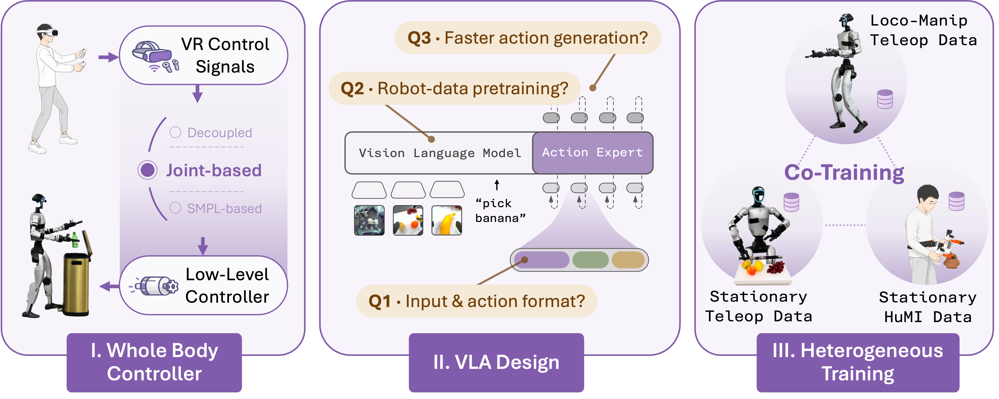

# OpenHLM：全身人形机器人移动操作的经验配方

OpenHLM 不是靠某一个新模块取胜，而是用系统化消融回答三个工程问题：怎样采集能表达全身运动的数据、怎样把已有 VLA 迁移到人形机器人，以及怎样用更便宜的人类或静态操作数据扩展任务覆盖。

{ loading=lazy }

图：OpenHLM 的三阶段构建路线。图片来自论文官方项目主页。

<!-- more -->

## 论文信息

- **论文：** [OpenHLM: An Empirical Recipe for Whole-Body Humanoid Loco-Manipulation](https://arxiv.org/abs/2606.22174)
- **作者：** Yingdong Hu, Haodong Zhu, Boyuan Zheng, Yihang Hu, Tong Zhang, Zunhao Chen, Junming Zhao, Ruiqian Nai, Yang Gao
- **时间：** 2026 年 6 月
- **机构：** 清华大学、上海期智研究院、Spirit AI
- **项目主页：** [openhlm-project.github.io](https://openhlm-project.github.io/)
- **代码：** [OpenHLM-project/OpenHLM](https://github.com/OpenHLM-project/OpenHLM)
- **数据与模型：** [Dataset](https://huggingface.co/datasets/OpenHLM/OpenHLM-data) · [Checkpoints](https://huggingface.co/OpenHLM/OpenHLM-ckpts)

!!! abstract "一句话总结"

    OpenHLM 给出的核心结论是：完整暴露全身自由度的遥操作、高质量机器人预训练和异构数据共训练，比反复微调动作接口细节更重要。

## 一、背景与问题

全身移动操作（whole-body loco-manipulation）要求机器人在走路的同时完成抓取、弯腰、下蹲、转身，甚至用脚或身体参与交互。它与“移动底盘 + 双臂机械臂”最大的不同，是动作之间存在强耦合：

- 手伸向高处时，腿和躯干需要共同改变姿态；
- 在狭窄空间操作时，落脚位置会直接影响手臂可达范围；
- 某些任务需要脚踩踏板、身体顶住物体，不能只控制双手；
- 语言指令最终要落到整条运动链，而不是单独的末端位姿。

很多已有系统把上半身操作和下半身移动拆成两个控制器。这样虽然更稳定，却限制了策略能表达的动作。OpenHLM 因此提出一个更直接的问题：

> 能否让一个 VLA 根据语言和视觉，直接生成覆盖人形机器人全部自由度的协调动作？

论文没有把答案归结为单一网络结构，而是按照“每次只改变一个因素”的方式，依次研究数据采集、模型适配和数据扩展。

## 二、整体系统

OpenHLM 使用两层控制结构：

1. **高层策略**在采集阶段由遥操作员担任，在部署阶段替换为 VLA，输出全身参考动作；
2. **低层控制器**负责稳定地追踪这些参考动作，并驱动真实 Unitree G1。

可以把高层策略抽象为：

$$
\hat{\mathbf{a}}_{t:t+H}
= \pi_\theta
\left(
\mathbf{o}^{\text{head}}_t,
\mathbf{o}^{\text{wrist}}_t,
\mathbf{s}_t,
\ell
\right)
$$

其中，输入包含头部与腕部视觉、机器人本体状态和语言指令；输出是未来一段时间的全身动作序列。低层控制器再把参考动作转换为稳定、连续的机器人运动。

论文的构建路线分成三个阶段：

    全身遥操作与低层控制
              ↓
        全身 VLA 策略设计
              ↓
          异构数据共训练
              ↓
      OpenHLM 全身移动操作系统

## 三、阶段一：什么样的遥操作数据有效

作者在相同任务上比较了三种遥操作接口：

| 遥操作方式 | 动作维度 | 能表达的动作 | 主要限制 |
| --- | ---: | --- | --- |
| 解耦控制 | 21-D | 双臂 IK、底盘速度和身体高度 | 上下半身仍然分离 |
| VR 三点控制 | 24-D | 头部、双腕位姿和移动指令 | 只暴露少量关键点 |
| 关节级全身遥操作 | 32-D | 实时重定向到全部人形关节 | 采集设备与操作要求更高 |

在三个代表任务中，只有关节级全身遥操作能够完成全部任务：

| 方法 | 可乐放置 | 高架杯子转移 | 瓶子丢弃 |
| --- | ---: | ---: | ---: |
| 解耦控制 | 66.7% | 93.3% | 不支持 |
| VR 三点控制 | 40.0% | 不支持 | 不支持 |
| **关节级全身遥操作** | **86.7%** | **80.0%** | **85.0%** |

这里的重要结论并不只是“32-D 更高维”，而是数据采集接口决定了策略能够学到什么。如果遥操作阶段从未暴露脚、腰和全身协调，后面的 VLA 也无法凭空学会这些能力。

## 四、阶段二：把 VLA 迁移到人形机器人

OpenHLM 以在静态或轮式双臂机器人数据上预训练的 $\pi_{0.5}$ 为基础，再将动作空间和本体状态适配到人形机器人。

作者考察了动作投影初始化、关节排列方式、绝对/相对动作、本体状态输入以及推理步数等因素。部分消融结果如下：

| 配置 | 平均任务进度 |
| --- | ---: |
| **OpenHLM 默认配置** | **91.3%** |
| 随机动作投影 | 82.1% |
| 不输入本体状态 | 81.2% |
| 只使用 PaliGemma 初始化 | 59.6% |
| 完全随机初始化 | 41.7% |
| 单步 Flow 推理 | 72.9% |

### 4.1 机器人预训练可以跨本体迁移

从 $\pi_{0.5}$ 机器人预训练权重初始化后，模型达到约 91% 的任务进度；保留相同视觉语言架构、但只用 PaliGemma 初始化时降到约 60%；随机初始化进一步降到约 42%。

这说明静态或轮式机器人上的操作先验并没有因为本体变化而失效。视觉对齐、语言理解、抓取和物体交互等知识仍然能够迁移到人形机器人的全身动作空间。

### 4.2 动作误差低，不等于真机表现好

论文还发现，单步生成方案在验证集上的 action MSE 可能更低，但真机任务进度比十步 Flow Matching 推理低约 20 个百分点。因此最终系统保留多步生成。

!!! warning "离线指标的陷阱"

    动作预测误差只衡量模型是否接近数据集中的动作，并不能完整反映闭环执行中的稳定性、误差恢复和长时序一致性。机器人策略最终仍要通过真实闭环任务验证。

## 五、阶段三：用更便宜的数据扩展任务

完整的全身遥操作数据昂贵，而且每增加一个任务都需要占用真实机器人。OpenHLM 进一步比较两类替代数据：

- **Stationary Teleop：** 机器人双脚固定，只采集上半身操作；
- **HuMI：** 使用手持 UMI 夹爪、身体追踪器和腕部相机采集人类演示，不需要真实人形机器人参与。

| 数据来源 | 每个保留任务的采集时间 | 特点 |
| --- | ---: | --- |
| 全身遥操作 | 21 分钟 | 信息最完整，但成本最高 |
| 静态遥操作 | 13 分钟 | 使用真实机器人，但不采集移动 |
| HuMI | 7 分钟 | 不占用机器人，采集成本最低 |

实验先只用任务 1–8 的全身遥操作训练，再用便宜的数据补充从未出现过的任务 9–11：

| 训练数据 | 保留任务平均进度 |
| --- | ---: |
| 8 任务基础模型 | 36% |
| + HuMI 共训练 | 84% |
| + 静态遥操作共训练 | 89% |
| 11 任务全身遥操作 Oracle | 96% |

也就是说，HuMI 和静态遥操作都能在不增加对应任务全身遥操作的情况下，把新任务表现提升到接近昂贵 Oracle 的水平。

## 六、主要实验结果

### 6.1 长时序水果整理

机器人需要在低桌、中桌和高架之间移动，根据语言指定的顺序双手拿取水果，再分别放入容器。任务覆盖较大的垂直工作空间，并包含 20 种有序水果组合。

| 方法 | 示范时间 | 任务进度 |
| --- | ---: | ---: |
| **OpenHLM（HuMI 共训练）** | **1.14 小时** | **87.5%** |
| GR00T N1.6 | 2.70 小时 | 57.5% |
| $\Psi_0$ | 2.70 小时 | 48.8% |

OpenHLM 使用不到两个基线一半的示范时间，仍取得更高任务进度。

### 6.2 十二类全身任务

论文设计了 12 个语言条件任务，覆盖四类能力：

1. 带移动的抓取与放置；
2. 通过下蹲、伸展扩大工作空间；
3. 把脚或身体其他部位当作操作工具；
4. 在狭窄空间或环境约束下完成移动操作。

官方项目页报告 OpenHLM 在全部 12 个任务上的平均任务进度超过 90%。此外，将 20 条室外演示与室内数据混合后，模型还能执行室外自主清理任务。

## 七、我的理解

### 7.1 贡献更像“实验路线图”

这篇论文最有价值的部分不是一个孤立的新模块，而是一套经过消融验证的优先级：

> 先保证数据接口能够表达全身动作，再利用已有机器人预训练，最后用异构数据降低任务扩展成本。

它告诉我们哪些设计值得优先投入，也告诉我们哪些动作接口细节并不是主要瓶颈。

### 7.2 数据接口本身也是模型设计

通常我们把遥操作看作单纯的采集工具，但 OpenHLM 表明：遥操作接口定义了动作空间，也定义了策略能观察到的协调关系。一个被解耦的数据接口，会直接给学习系统设置能力上限。

### 7.3 仍然存在的限制

- 主要结论来自特定机器人、控制栈、VLA 骨干和任务集合，是否能直接推广到其他本体仍需验证；
- “任务进度”能够描述长任务完成到哪一步，但不等同于严格的整任务成功率；
- 系统仍依赖低层全身控制器，并不是从像素直接输出电机力矩的完全端到端方案；
- HuMI 共训练已经显著降低数据成本，但与完整全身遥操作 Oracle 之间仍存在差距。

这些限制并不削弱论文价值，反而说明它更像一份可复用、可继续验证的工程配方。

## 八、相关资料

- [论文摘要与 PDF](https://arxiv.org/abs/2606.22174)
- [官方项目主页](https://openhlm-project.github.io/)
- [官方代码仓库](https://github.com/OpenHLM-project/OpenHLM)
- [Hugging Face 数据集](https://huggingface.co/datasets/OpenHLM/OpenHLM-data)
- [Hugging Face 模型权重](https://huggingface.co/OpenHLM/OpenHLM-ckpts)
