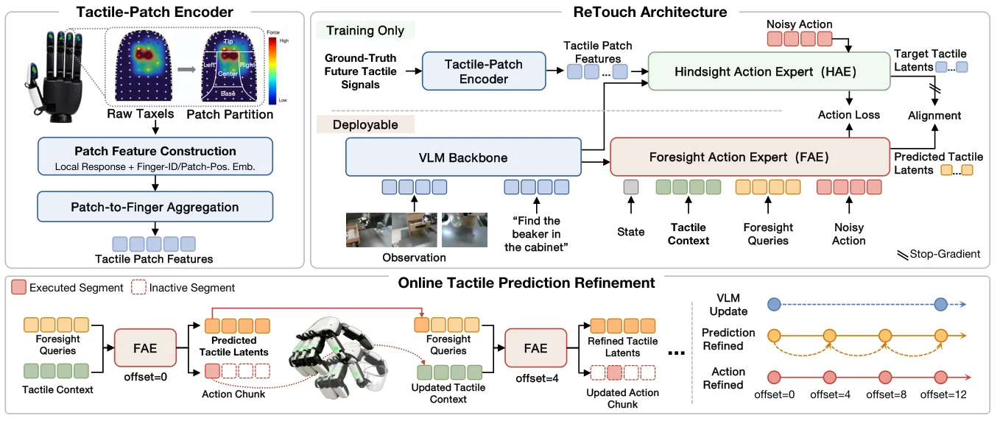

# ReTouch：在线触觉预测修正驱动的接触丰富灵巧操作

ReTouch 面向 contact-rich dexterous manipulation。论文的核心并不是简单把 tactile 作为 VLA 的额外输入，而是先构造保留手指与局部接触结构的 tactile representation，再让策略预测未来 tactile latent，并在动作执行过程中利用新到来的真实 tactile 持续修正未来 tactile prediction 和剩余 action。

<div class="paper-overview" markdown>

{ loading=lazy }

<span class="paper-overview__caption">图：ReTouch 的 Tactile-Patch Encoder、Hindsight/Foresight Action Experts 与在线触觉预测修正框架。图片来自论文官方版本。</span>

</div>

<!-- more -->

## 论文信息

- **论文：** [ReTouch: Empowering Contact-Rich Dexterous Manipulation with Online-Refined Tactile Prediction](https://arxiv.org/abs/2608.01824)
- **作者：** Shiqi Zhang, Xin Zhang, Yedong Shen, Yao Li, Yuxuan Gao, Sha Zhang, Yuan Zhang, Kaixue Long, Jiajia Wu, Jia Pan, Jiajun Deng, Yanyong Zhang
- **机构：** University of Science and Technology of China, iFLYTEK, The Chinese University of Hong Kong
- **版本：** arXiv:2608.01824v2, 2026-08-18
- **机器人平台：** UR7e + XHand
- **基础策略：** pretrained π0

## 1. 研究背景与整体框架

视觉能够提供场景和任务语义，但在多指接触中很难直接判断具体接触位置、接触力以及抓取是否开始滑动。已有 tactile policy 一类直接融合当前触觉，另一类预测 future tactile 或利用高频 tactile 修正 action。ReTouch 进一步把两者结合起来：future tactile prediction 本身也在执行过程中持续更新。

论文训练分为两个 Stage：

```text
Stage I：Tactile-Patch Encoder Pretraining

Raw Dense Tactile
        ↓
保留 finger identity 和局部 contact topology
        ↓
Pretrained Tactile-Patch Encoder


Stage II：ReTouch Policy Training

Pretrained π0
+
Pretrained Tactile-Patch Encoder
        ↓
HAE + FAE Joint Training
        ↓
Future Tactile Latent Learning
+
Flow-Matching Action Generation
+
Random-Offset Refinement Training
        ↓
Final ReTouch Policy
```

训练完成后删除 HAE 和 alignment projector，只保留 VLM、FAE 和部署侧 Tactile-Patch Encoder。

---

## 2. 数据与 Policy Interface

XHT-Dataset 在真实 UR7e + XHand 平台采集，共 900 条 demonstrations，覆盖 Pipette Press、Bottle Grasp、Cob Grasp、Sponge Wipe、Button Press、Cabinet Retrieval 和 Liquid Transfer 七个 contact-rich tasks。

一条 demonstration 同步记录：

```text
1 × Wrist RGB
+
2 × External RGB
+
Language Instruction
+
18D Robot State
+
18D Robot Action
+
Dense Tactile Stream
```

Robot state 由 UR7e 与 XHand 的关节状态拼接而成：

$$
6\mathrm{D}\ \text{UR7e joints}
+
12\mathrm{D}\ \text{XHand joints}
=
18\mathrm{D}.
$$

策略输出同样为 18D absolute joint-position commands。

XHand 每根手指包含 120 个三轴 force taxels，因此一帧 tactile 为：

$$
\tau_t \in \mathbb{R}^{5\times120\times3}
$$

其中每个 taxel 记录：

$$
(f_x,f_y,f_z)
$$

Policy 使用 16-step action horizon。触觉输入包含过去 9 帧和当前 1 帧：

$$
T_t=[\tau_{t-9},\ldots,\tau_t]
$$

---

## 3. Stage I：Tactile-Patch Encoder Pretraining

### 3.1 Stage I 流程

```text
一帧 Raw Tactile
5 fingers × 120 taxels × 3D force
        ↓
每根手指按照固定 sensor geometry
划分为 5 个 functional patches

Tip / Center / Base / Left / Right
        ↓
每个 Patch 统计局部接触信息

Mean 3D Force
Max Absolute 3D Force
Contact Area
Contact Strength
        ↓
8D Patch Descriptor
        ↓
8 → 256 → 1024 MLP + SiLU
        ↓
加入
Finger-ID Embedding
+
Patch-Position Embedding
        ↓
5 个 Patch Features / Finger
        ↓
Learned Weighted Pooling
        ↓
1 个 1024D Finger Token
        ↓
一帧得到 5 个 Finger Tokens
        ↓
三个 Training-Only Prediction Heads

Contact Distribution
Patch Mean Force
Contact State
        ↓
L_TPE
        ↓
20K Steps
        ↓
删除三个 Prediction Heads
        ↓
Pretrained Tactile-Patch Encoder
```

### 3.2 Patch Representation

ReTouch 不直接 flatten 一整根手指的 tactile。每根手指先按照固定 sensor geometry 划为 Tip、Center、Base、Left、Right 五个区域。每个 patch 根据其中的 taxels 计算：

$$
u_p=[\bar f_p;m_p;a_p;q_p]
$$

其中：

- $\bar f_p$：contact-gated mean 3D force；
- $m_p$：component-wise maximum absolute force；
- $a_p$：contact area；
- $q_p$：contact strength。

因此 descriptor 维度为：

$$
3+3+1+1=8
$$

8D descriptor 经 `8 → 256 → 1024` 的 SiLU MLP 映射成 patch feature，再加入 Finger-ID Embedding 和 Patch-Position Embedding，使网络同时保留“触觉是什么”“来自哪根手指”“位于手指哪个区域”。

### 3.3 Patch-to-Finger Aggregation

一根手指包含五个 patch features。作者使用 learned weighted pooling 将它们聚合成一个 1024D Finger Token，权重同时受 patch feature 和 contact area 影响。

最终：

```text
1 frame
↓
Thumb Token
Index Token
Middle Token
Ring Token
Little Token
```

因此 dense tactile 被压缩为每帧 5 个结构化 tactile tokens，而不是直接把所有 raw taxels flatten 后交给 policy。

### 3.4 Stage I Loss

三个 prediction heads 分别要求 Finger Token 能恢复：

```text
五个 Patch 的 Contact-Strength Distribution
五个 Patch 的 Mean 3D Force
五个 Patch 的 Contact State
```

总损失为：

$$
L_{\mathrm{TPE}}
=
\lambda_{\mathrm{dist}}L_{\mathrm{CE}}
+
\lambda_{\mathrm{force}}L_{\mathrm{force}}
+
\lambda_{\mathrm{contact}}L_{\mathrm{BCE}}
$$

这些 heads 只用于预训练。它们的作用是约束压缩后的 Finger Token 仍然保留局部 contact location、force 和 contact strength，而不是要求对 raw tactile 做无损重建。

Stage I 训练 20K steps。训练结束后删除三个 heads，保留 Tactile-Patch Encoder 权重用于 Stage II。

---

## 4. Stage II：HAE + FAE Joint Policy Training

### 4.1 Stage II 流程

```text
Pretrained π0
+
Stage-I Tactile-Patch Encoder
        ↓

RGB + Language
        ↓
VLM
        ↓
Cached VLM Hidden Features c_k
        │
        ├───────────────────────────────┐
        │                               │
        ▼                               ▼
──────────────── HAE ────────────────   ─────────────── FAE ───────────────
Training Only                          Deployable

Robot State                            Robot State
Observed Tactile                       Observed Tactile
GT Future Tactile                      Learnable Foresight Queries
Noisy Action                           Noisy Action
        ↓                                      ↓
Tactile-Patch Encoder                    FAE Transformer
        ↓                                      ↓
GT Future Tactile Tokens                 Predicted Future Tactile Latents
        ↓                                      │
HAE Transformer                                │
        ↓                                      │
Layer 12 Target Tactile Latents ── Alignment ──┘
        │
        └───────────────────────────────┐
                                        │
HAE Action Flow                  FAE Action Flow
        ↓                               ↓
L_act^hid                        L_act^fore

                 +
          Random-Offset Training
          （取值见 §4.5）
                 ↓
      Mid-Chunk Tactile / Action Update
                 ↓
              L_update

                 ↓
            L_policy
                 ↓
        Joint Backpropagation
                 ↓
         80K Policy Steps
```

HAE 和 FAE 不是先后训练的两个模型，而是在 Stage II 中联合训练。HAE 是 privileged training branch，FAE 是最终部署分支。

### 4.2 Observed Tactile Context

Policy 使用过去 9 帧和当前 1 帧 tactile。Tactile-Patch Encoder 每帧产生 5 个 finger tokens。

为了控制 token 数量，前 9 帧对每根手指进行 temporal pooling：

```text
Past 9 Frames
5 Finger Tokens / Frame
        ↓
按 Finger 做 Temporal Pooling
        ↓
5 History Tokens

Current Frame
        ↓
5 Current Tokens
```

最终 observed tactile context 由 10 个 tactile tokens 表示。

### 4.3 Hindsight Action Expert

HAE 训练时可以读取 ground-truth future tactile，因此它承担构造 future tactile supervision 的作用。

16-step future tactile 被组织为四个 4-step temporal segments，每个 segment 对应 5 根手指，因此形成 20 个 future tactile positions。

```text
VLM Hidden Features
+
Robot State
+
Observed Tactile
+
GT Future Tactile
+
Noisy Action
        ↓
HAE
        ↓
Action Flow Prediction
        ↓
L_act^hid

同时：
HAE Layer 12
        ↓
20 个 Future-Tactile Hidden Features
        ↓
Z^{+,hid}
```

这 20 个 hidden features 并不是额外通过 prediction head 输出，而是直接取 HAE 第 12 层相同 future-tactile positions 的 hidden states。

由于 HAE 自身需要利用 GT future tactile 生成正确 action，action loss 会推动这些 hidden features 保留与后续动作有关的 contact information，因此它们被用作 FAE 的 target tactile latents。

### 4.4 Foresight Action Expert

部署时无法看到真实 future tactile，因此 FAE 使用 20 个 learnable Tactile Foresight Queries 替代 GT future tactile tokens。

```text
VLM Hidden Features
+
Robot State
+
Observed Tactile
+
20 Foresight Queries
+
Noisy Action
        ↓
FAE Transformer
        ↓
Layer 12
20 Predicted Future-Tactile Hidden Features
        ↓
Ẑ^+
```

Foresight Query 是可学习输入 token。它通过 Transformer Attention 读取视觉语言条件、robot state 和 observed tactile，并逐层更新为当前样本下的 future tactile representation。

FAE 与 HAE 的对应位置通过 cosine distance 对齐：

$$
L_{\mathrm{align}}
=
d_{\mathrm{cos}}
\left(
g_\psi(\hat Z^+),
\operatorname{sg}(Z^{+,\mathrm{hid}})
\right)
$$

其中 $g_\psi$ 是 `1024 → 1024 → 1024` projector，`sg` 表示 stop-gradient。Alignment loss 只推动 FAE 靠近 HAE target，不通过这条 loss 更新 HAE。

FAE 同时生成 action flow，并计算：

$$
L_{\mathrm{act}}^{\mathrm{fore}}
$$

因此 FAE 的 future tactile representation 同时受到 latent alignment 和 action generation 两个方向的训练。

### 4.5 Online-Refinement Training

只在 chunk 开头预测一次 future tactile 容易在接触变化后变得过时，因此 ReTouch 在训练中模拟执行到中间位置的状态。

```text
Chunk Start

Q Q Q Q
↓
FAE
↓
Z1 Z2 Z3 Z4
↓
执行前4步


Refinement after Step 4

Z1 | Q Q Q
+
最新 Tactile Context
↓
FAE
↓
Refined Tactile Latents
+
Updated 16-Step Action Chunk


Refinement after Step 8

Z1' Z2' | Q Q
+
最新 Tactile Context
↓
FAE


Refinement after Step 12

Z1'' Z2'' Z3'' | Q
+
最新 Tactile Context
↓
FAE
```

这里每个 `Z` 表示一个 4-step temporal segment 的 5 个 finger latents。

ReTouch 的 horizon 不向前滚动。在第 4、8、12 步修正时，重新生成的 16-step action chunk 始终与原 chunk 起点对齐，只丢弃已经执行的 prefix 并使用剩余 suffix。

训练时随机采样：

$$
o\in\{4,8,12\}
$$

使用对应时刻的最新 tactile context、carried-over latent prefix 和剩余 action supervision 训练 mid-chunk refinement，这部分记为：

$$
L_{\mathrm{update}}
$$

### 4.6 Stage II Loss 与参数更新

Stage II 总 loss 为：

$$
L_{\mathrm{policy}}
=
L_{\mathrm{act}}^{\mathrm{hid}}
+
L_{\mathrm{act}}^{\mathrm{fore}}
+
\lambda_{\mathrm{align}}L_{\mathrm{align}}
+
L_{\mathrm{update}}
$$

其中：

$$
\lambda_{\mathrm{align}}=0.1
$$

训练设置：

```text
Policy Training：80K steps

HAE / FAE：
Joint Training

Tactile-Patch Encoder：
前 5K policy steps Frozen
5K 后 Unfreeze
与 Policy End-to-End Training
```

HAE 和 FAE 使用结构相同但参数独立的 Tactile-Patch Encoders。

---

## 5. 核心模型与算法

### 5.1 Tactile-Patch Encoder

Tactile-Patch Encoder 的重点不是单纯降低维度，而是显式保留 tactile topology：

```text
Raw Taxels
↓
Functional Patch
↓
Finger Identity
+
Patch Position
+
Local Force / Contact Information
↓
Finger Token
```

与 `Flatten + MLP` 相比，它保留了“哪根手指的哪个局部区域正在怎样接触”的结构，这对多指精细调整更直接。

### 5.2 HAE 与 FAE

HAE 和 FAE 都是 18-layer Transformer Action Experts，hidden width 为 1024，使用 8 个 attention heads。

HAE 具有训练时 privileged information：

```text
GT Future Tactile
↓
HAE
↓
Action-Relevant Future Tactile Targets
```

FAE 只能读取部署时可以获得的信息：

```text
Current / Historical Tactile
+
VLM Condition
+
Robot State
+
Foresight Queries
↓
FAE
↓
Predicted Future Tactile Latents
+
Action
```

训练结束后 HAE 被删除。

### 5.3 Foresight Query

Foresight Query 是 learnable token，不是 Attention 公式中的 Q 本身。它作为 Transformer sequence 中的 future tactile slot，进入每一层后再通过线性投影产生对应的 Attention Q/K/V。

同一个 Query parameter 会用于大量不同 demonstration，但它读取到的 current observation 不同，因此最终 hidden feature 也不同。Query 学到的是适合某个 future temporal/finger position 的查询起点，而不是记住某一个固定 tactile value。

### 5.4 Directional Attention

FAE 使用 directional attention mask：

```text
VLM / State / Observed Tactile / Carried Latent
                    ↓
          Future Tactile Latents
                    ↓
               Action Tokens
```

Foresight tactile positions 不能 attend action tokens，而 action tokens 可以 attend 同一次 FAE call 中更新后的 future tactile latents。

这样可以避免 action information 反向泄漏进 tactile prediction，并保证 action update 使用当前刚刚修正过的 tactile representation。

### 5.5 Flow Matching

ReTouch 的动作生成继承 π0 的 flow-based action generation。训练时从 GT 16-step action chunk 构造 noisy/intermediate action，HAE 和 FAE 都学习 action flow；推理时从 action noise 出发，通过 10 个 explicit-Euler steps 得到最终 action chunk。

因此 HAE/FAE 不只是 tactile predictor，本身就是 action-generating module。

---

## 6. 推理流程

部署时删除：

```text
Hindsight Action Expert
Alignment Projector
```

保留：

```text
VLM
+
Foresight Action Expert
+
FAE Tactile-Patch Encoder
```

ReTouch 使用 multi-rate asynchronous execution。VLM 负责较慢的视觉语言理解，FAE 负责高频 tactile prediction 和 action revision。

```text
RGB + Language
        ↓
VLM @ 9 Hz
        ↓
Cached VLM Hidden Features c_k
        │
        │
        ▼
────────────────────────────────
Chunk Start
────────────────────────────────

Robot State
+
Current / Historical Tactile
+
Q Q Q Q
+
Action Noise
        ↓
FAE @ 36 Hz
        ↓
Future Tactile Latents Z1 Z2 Z3 Z4
+
16-Step Action Chunk
        ↓
执行 step 0~3


────────────────────────────────
Refinement after Step 4
────────────────────────────────

最新 Tactile Context
+
Z1 | Q Q Q
+
同一个 Cached VLM Context
        ↓
FAE
        ↓
Refined Tactile Latents
+
Regenerated 16-Step Action
        ↓
丢弃 0~3
执行 step 4~7


────────────────────────────────
Refinement after Step 8
────────────────────────────────

最新 Tactile
+
Z1' Z2' | Q Q
        ↓
FAE
        ↓
再次修正 Prediction + Action
        ↓
执行 step 8~11


────────────────────────────────
Refinement after Step 12
────────────────────────────────

最新 Tactile
+
Z1'' Z2'' Z3'' | Q
        ↓
FAE
        ↓
再次修正
        ↓
执行 step 12~15

        ↓
下一次 VLM Update
        ↓
开启新的 16-Step Chunk
```

一个 chunk 内 VLM hidden features 和 chunk-start robot state 被缓存复用，FAE 通过最新 tactile 高频更新。每次 refinement 都重新生成完整 16-step action chunk，但只执行当前修正位置后尚未执行的 suffix。

Full ReTouch 使用 blocking refinement，即执行到 refinement point 后暂时保持上一条 command，等待新的 FAE 结果再继续执行。论文的 non-blocking ablation 表明，更新延迟约一个 action step 后性能会明显下降。

ReTouch 因此不是标准 rolling-horizon policy。它的 16-step horizon 在一个 cycle 内保持与原 chunk 起点对齐，只在 offset 0/4/8/12 对同一个 chunk 的 tactile prediction 和剩余 action 做闭环修正。

---

## 7. 消融实验与实验结论

ReTouch 在七个真实任务上的平均 success rate 为 83.6%，相比平均最强 baseline Tactile-VLA 提高 18.4 percentage points；在 challenging settings 下平均达到 73.1%，比最强 baseline 高 23.8 points。

主要消融结果：

| Variant | Avg. | 变化 |
|---|---:|---:|
| Full ReTouch | 83.6 | — |
| w/o intra-chunk refinement | 60.0 | -23.6 |
| w/o tactile-prediction refinement | 68.4 | -15.2 |
| w/o future tactile prediction | 67.6 | -16.0 |
| non-blocking joint refinement | 75.8 | -7.8 |
| w/o Tactile-Patch Encoder | 69.1 | -14.5 |

去掉 intra-chunk refinement 的下降最大，说明 contact-rich manipulation 中只在 chunk 开头预测一次 action 很难应对滑移和接触变化。固定 future tactile prediction 但继续更新 action 的效果与完全去掉 future tactile prediction 接近，说明真正有价值的不是“预测一次未来触觉”，而是根据最新 tactile 持续修正预测。

去掉 Tactile-Patch Encoder 后，将 raw tactile flatten 后用 MLP 编码，平均性能从 83.6% 降至 69.1%。这说明 tactile representation 并非附属模块，保留 finger identity 和局部 contact region 对灵巧操作具有明显作用。

---

## 8. Conclusion

ReTouch 的主要结论是，触觉在灵巧操作中的价值不应只停留在“当前 tactile 作为额外 observation”。对于接触不断变化的长 action chunk，未来 tactile prediction 也会因为滑移、接触位置变化和执行误差快速过时，因此 tactile prediction 本身需要进入执行闭环。

论文通过 Tactile-Patch Encoder、HAE/FAE latent alignment 和 high-frequency online refinement 建立了一条完整链路。Stage I 先把 dense XHand taxels 压缩成保留 finger identity 与 local contact topology 的 Finger Tokens；Stage II 中，HAE 利用训练时真实 future tactile 构造 action-relevant tactile targets，FAE 从当前视觉语言条件、robot state 和 tactile history 中预测对应 latent，并同时生成 action。执行时只保留 FAE，通过 9 Hz VLM 与 36 Hz FAE 的多频率结构，在一个 16-step action chunk 内每 4 step 使用最新 tactile 重新修正 future tactile latent 和剩余 action。

实验说明两个因素都很重要：一是触觉需要合适的结构化表示，二是 future tactile prediction 需要随着真实交互持续更新。ReTouch 因而更接近一个“预测未来接触状态并在线修正该预测的闭环 VLA”，而不是简单的 tactile-conditioned action policy。

从后续研究角度看，ReTouch 的 Tactile-Patch Encoder 仍然明显依赖 XHand 的传感器布局和固定 taxel-to-patch mapping。其方法证明了 tactile encoder 的设计会显著影响下游 manipulation performance，但并没有解决不同灵巧手、不同触觉传感器之间如何获得统一且可迁移的 tactile representation。这也是将该思路迁移到其他 tactile dexterous hands 时最直接的问题。
