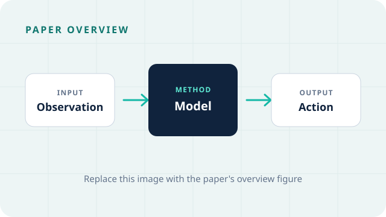

# 论文名称

用一两段话概括论文解决的问题、核心思路，以及为什么值得阅读。这部分会显示在首页文章列表中。

{ loading=lazy }

图：论文方法总览。

<!-- more -->

## 论文信息

- **论文：** [标题](论文链接)
- **作者：** 作者列表
- **会议 / 期刊：** 会议或期刊，年份
- **代码：** [GitHub](代码链接)
- **项目主页：** [Project Page](项目链接)

## 一、背景与问题

介绍研究背景、论文要解决的具体问题，以及已有方法的不足。只保留理解后真正重要的上下文。

## 二、核心方法

先用自己的话说明整体思路，再根据论文结构补充关键模块或步骤。不必为了套模板强行拆成固定阶段；如果论文的训练 recipe 是理解重点，可以像 Stage I / II / III 一样详细展开。

### 2.1 关键模块

说明这个模块的输入、作用与输出；需要时加入公式、示意图或伪代码。例如：

$$
\mathcal{L} = \mathcal{L}_{\text{task}} + \lambda \mathcal{L}_{\text{aux}}
$$

### 2.2 训练与推理

记录训练数据、损失函数、训练策略，以及推理时真正发生的流程。没有特别之处时可以删掉本节。

## 三、实验结果

说明数据集、指标和最重要的结果。与其抄完整表格，更适合记录支持论文结论的证据和值得注意的对比。

| 方法 | 指标 | 结果 |
| --- | --- | --- |
| Baseline | Metric | - |
| 本文方法 | Metric | - |

## 四、我的理解

记录自己的判断，例如：

- 这篇论文最有价值的想法是什么？
- 方法成立依赖哪些假设？
- 有哪些限制、疑问或可以复现的细节？
- 它和哪些工作存在联系？

## 五、相关资料

- [论文](论文链接)
- [代码](代码链接)
- [相关工作](链接)
